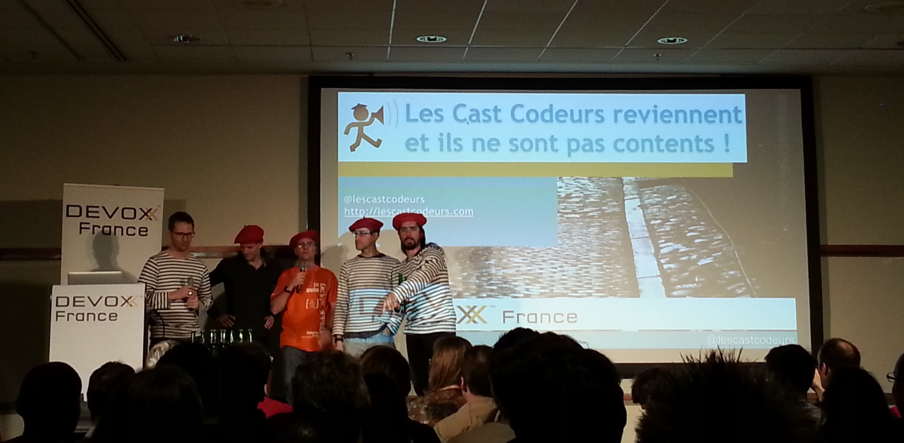

En attendant que les vidéos des [différentes conférences de l’édition 2014](http://cfp.devoxx.fr/devoxxfr2014) de Devoxx France soient mises en ligne sur [Parleys](http://www.parleys.com/) et en complément des [supports](http://www.parleys.com/) déjà mis en ligne par certains Speakers, je mets librement à votre disposition les différentes notes que j’ai pu prendre sur mon laptop.
Les sujets sont variés : de Docker à Angular JS, en passant par Java 8. Certaines pourront être lues de manière autonome ; je pense par exemple au quickie [Outils pour manager une équipe](Outils-pour-manager-une-équipe.pdf) et à la conférence [33 things your want to do better](33-things-your-want-to-do-better.pdf). Pour être exploitables en l’état, d’autres notes demanderont à ce que vous ayez assisté à la conférence ou que vous ayez pu récupérer les supports de présentation.

Sans plus attendre, voici donc mes 14 notes triées par ordre chronologique :

1. [Java 8 - Streams et Collectors](Java-8-Streams-et-Collectors.pdf)
1. [Créons un web component avec Polymer](Créons-un-web-component-avec-Polymer.pdf)
1. [JBoss Forge in Action](JBoss-Forge-in-Action.pdf)
1. [Un PaaS Java Docker en 30 minutes](Un-PaaS-Java-Docker-en-30-minutes.pdf)
1. [Les Applications Réactives](Les-Applications-Réactives.pdf)
1. [Au secours mon code Angular est pourri](Au-secours-mon-code-Angular-est-pourri.pdf)
1. [Spring4TW et Boot](Spring4TW-et-Boot.pdf)
1. [Do you really get Classloaders](Do-you-really-get-Classloaders.pdf)
1. [Outils pour manager une équipe (de développement)](Outils-pour-manager-une-équipe.pdf)
1. [RxJava et Java 8](RxJava-et-Java-8.pdf)
1. [Google App Engine, çà bouge beaucoup](Google-App-Engine-çà-bouge-beaucoup.pdf)
1. [Deux années de Continuous Delivery au pays des Traders](Deux-années-de-Continuous-Delivery-au-pays-des-Traders.pdf)
1. [Bootstrap your productivity with Spring Boot](Bootstrap-your-productivity-with-Spring-Boot.pdf)
1. [33 things your want to do better](33-things-your-want-to-do-better.pdf)

Bonne lecture, découverte ou redécouverte et, je l’espère, à l’année prochaine pour Devoxx France 2015 !!
