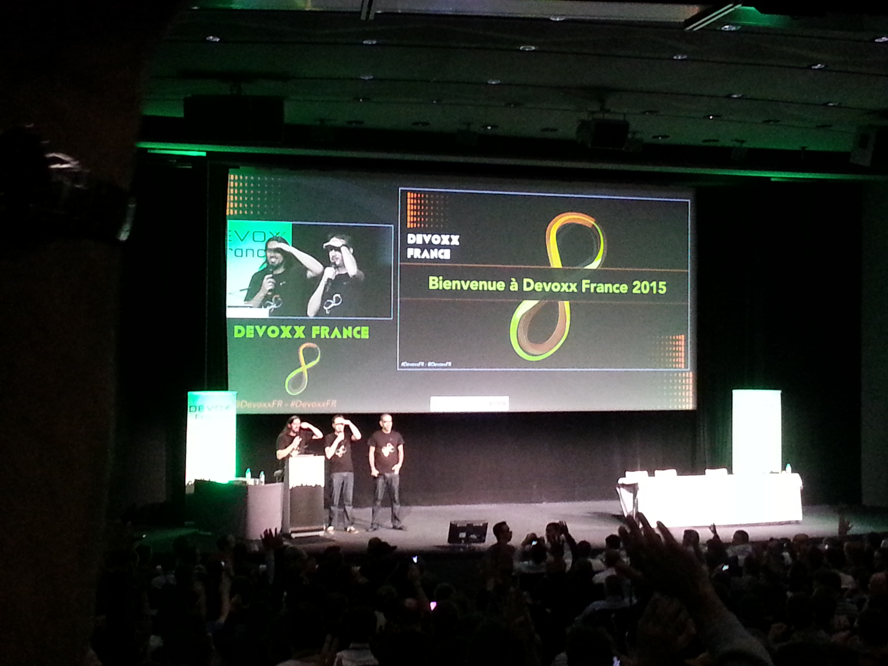

En attendant que les vidéos des [différentes conférences de l’édition 2015](http://cfp.devoxx.fr/2015/index.html) de Devoxx France soient mises en ligne sur [Parleys](http://www.parleys.com/) et en complément de certains supports déjà mis en ligne par certains Speakers, je mets librement à votre disposition les différentes notes que j’ai pu prendre sur mon laptop.

Les sujets sont variés : du **Machine Learning** avec Watson, Spark et MMLib, du **Reactive Programming** avec RxJava et Vert.x, du **Java 9**, du **Spring 4.1** ou bien encore du Docker.

Certaines notes pourront être lues de manière autonome ; je pense par exemple au quickie [Stratégie de mise en place de revues de code](Devoxx_France_2015-Stratégie_de_mise_en_place_de_revues_de_code.pdf) et à la conférence [Livrer chaque jour ce qui est prêt !.](ploads/2015/04/Devoxx_France_2015-Livrer_chaque_jour_ce_qui_est_pret.pdf) Pour être exploitables en l’état, d’autres notes demanderont à ce que vous ayez assisté à la conférence ou que vous ayez pu récupérer les supports de présentation.

Sans plus attendre, voici donc mes 18 notes triées par ordre alphabétique :

- [Tout ce que vous avez toujours voulu savoir sur les clients Java http concurrents, asynchrones, sans oser demander !](Devoxx_France_2015-Clients_HTTP_Java_asynchrones.pdf)
- [Concurrency in Enterprise Java](Devoxx_France_2015-Concurrency_in_Entreprise_Java.pdf)
- [Créer des applications cognitives avec IBM Watson Engagement Explorer et Bluemix](Devoxx_France_2015-Creer-applications-cognitives-avec-IBM-Watson.pdf)
- [Elles ressemblent à quoi mes données ?](Devoxx_France_2015-Elles_ressemblent_a_quoi_mes_donnees-Elasticsearch_Logback_Kibana.pdf) avec la stack Elasticsearch, Logstash et Kibana
- [JDBC + JPA + Hibernate – Sans maitrise la puissance n’est rien !](Devoxx_France_2015-JDBC_JPA_Hibernate_Sans_maitrise_la_puissance_n_est_rien.pdf)
- [Les monoïdes démystifiées](Devoxx_France_2015-Les_monoides_demystifiees.pdf)
- [Livrer chaque jour ce qui est prêt](Devoxx_France_2015-Livrer_chaque_jour_ce_qui_est_pret.pdf)
- [Machine Learning avec Spark MMLIB et D3.js](Devoxx_France_2015-Machine_Learning_avec_Spark_MMLIB_et_3D.pdf)
- [Migration d'une web app sous Tomcat vers Vert.x](Devoxx_France_2015-Migration_d_une_webapp_Tomcat_vers_Vert.x.pdf)
- [Modern Entreprise Java  Architecture with Spring 4.1](Devoxx_France_2015-Modern_Entreprise_Java-_rchitecture_with_Spring_4.1.pdf)
- [Modular Java Platform](Devoxx_France_2015-Modular_Java_Platform.pdf) dans Java 9
- [Refactoring to Functional](Devoxx_France_2015-Refactoring_to_Functional.pdf) avec Kotlin
- [RxJava les mains dans le code](Devoxx_France_2015-RxJava_les_mains_dans_le_code.pdf)
- [Sortez couverts avec](Devoxx_France_2015-Sortez_couverts_avec_Hystrix.pdf) [Hystrix](Devoxx_France_2015-Sortez_couverts_avec_Hystrix.pdf)
- [Stratégie de mise en place de revues de code](Devoxx_France_2015-Stratégie_de_mise_en_place_de_revues_de_code.pdf)
- [Uniformisez vos postes de dev avec Docker Compose](Devoxx_France_2015-Uniformisez_vos_postes_de_dev_avec_Docker_Compose.pdf)
- [Unit testing concurrent code](Devoxx_France_2015-Unit_testing_concurrent_mode_with_ThreadWeaver.pdf) with ThreadWeaver
- [Vos Managers ne veulent pas entendre parler de la dette technique, tant mieux](Devoxx_France_2015-Vos_Managers_ne_veulent_pas_entendre_parler_de_la_dette_technique_tant_mieux.pdf)

Bonne lecture, découverte ou redécouverte et, je l’espère, à l’année prochaine pour Devoxx France 2016 !!
