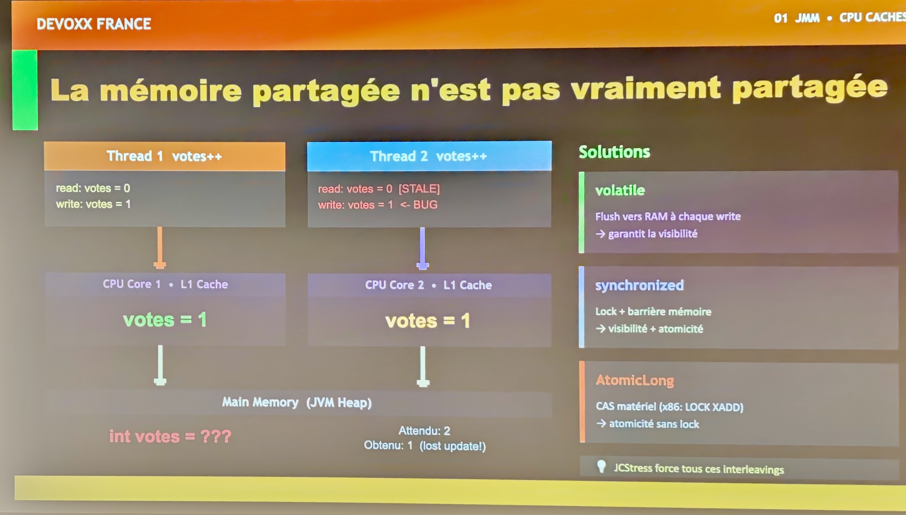
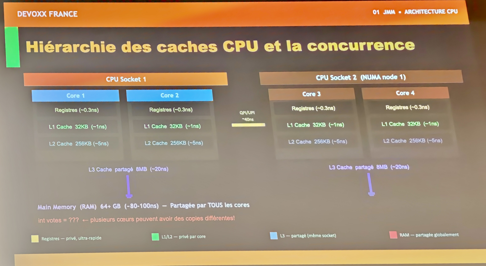
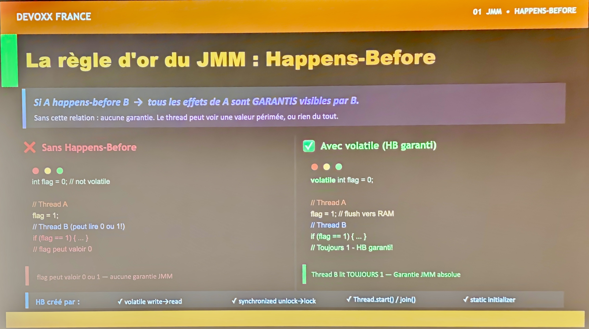
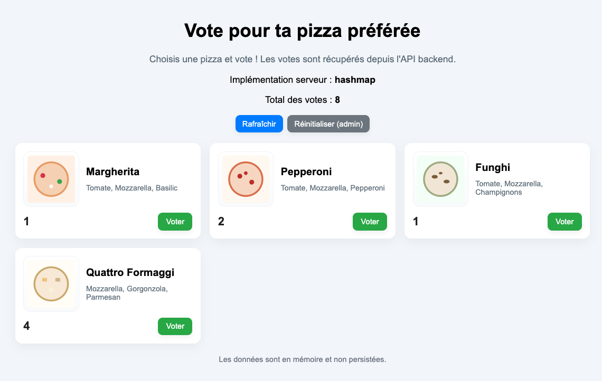
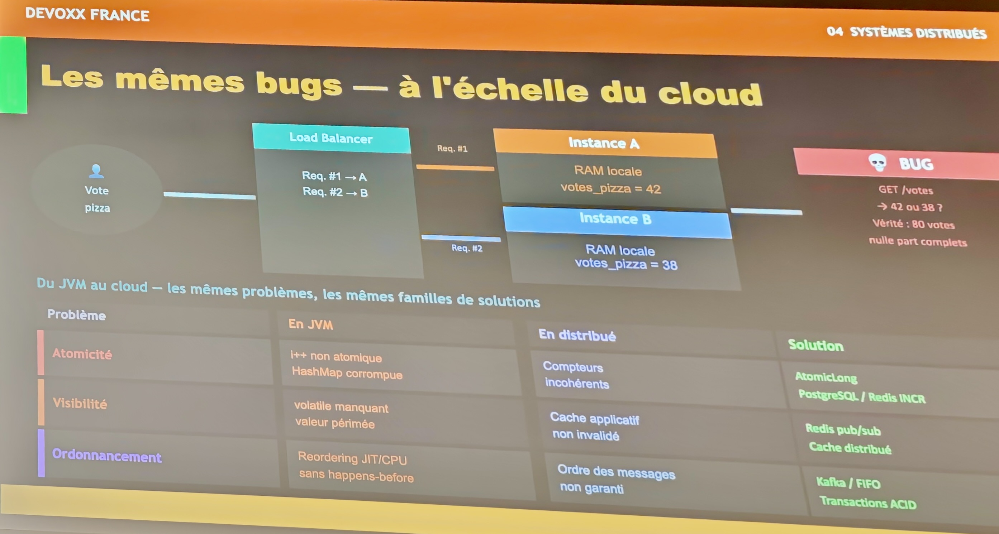

Conférence : [Devoxx France 2026](https://www.devoxx.fr/)<br>
Date : 24 avril 2026<br>
Speakers : Riad Maouchi (Société Générale CIB) et Christopher Etancelin (Société Générale)<br>
Format : Tools in action (30 min)<br>
Repo GitHub : https://github.com/christopher-etancelin/jcstress-devoxx-demo

Au cours de ce Tools in action, Riad et Christopher nous font découvrir un outil bien pratique
à utiliser sur notre code multi-threads.
Maintenu par [Aleksey Shipilëv](https://github.com/shipilev) (AWS),
**Java Concurrency Stress** ([JCStress](https://github.com/openjdk/jcstress))
est le **framework officiel d'OpenJDK** permettant de
**reproduire des bugs de concurrence d'accès** que d'autres outils n'arrivent pas à détecter.
Il met à l'épreuve le code Java en explorant de manière systématique
les différents entrelacements possibles entre threads.
Il peut ainsi faire émerger des bugs invisibles aux tests unitaires JUnit classiques :
problèmes de **visibilité**, d'**ordre d'exécution** ou d'**atomicité**.

## Le Java Memory Model

Les speakers commencent par quelques rappels sur le **[Java Memory Model](https://en.wikipedia.org/wiki/Java_memory_model)** (JMM)
et évoquent le problème classique de la **visibilité mémoire** en environnement multithreads Java.
Dans une application de vote, lorsque deux threads (hébergés sur 2 cœurs CPU Core 1 et CPU Core 2)
exécutent simultanément `votes++`, chacun lit la valeur depuis son propre cache L1 (100x plus rapide
que la RAM) ce qui signifie qu'ils peuvent tous les deux lire `votes = 0` avant que l'un ou l'autre
n'ait écrit en mémoire principale.
Le résultat attendu après deux incréments est `2`, mais on obtient `1`.
C'est le phénomène de **[lost update](https://www.baeldung.com/cs/concurrency-control-lost-update-problem)**,
causé par le fait que la mémoire partagée (JVM Heap ou tas) n'est pas immédiatement synchronisée
avec les caches CPU.
Le JMM définit trois solutions à ce problème :

1. `volatile`, qui force un flush vers la RAM à chaque écriture et garantit la visibilité,
2. `synchronized`, qui ajoute un lock et une barrière mémoire pour garantir à la fois visibilité et atomicité,
3. et `AtomicLong`, qui s'appuie sur une instruction matérielle CAS (`LOCK CMPXCHG` sur x86)
   pour une atomicité sans lock.

L'outil **JCStress** est recommandé pour reproduire et observer expérimentalement tous ces
**interleavings** (entrelacements) qui sont autrement difficiles à déclencher de manière déterministe
lors de tests (tests unitaires, QA, tests de charge).



Un autre facteur à connaître est la **hiérarchie des caches CPU** et son impact direct sur la
concurrence en Java.
Chaque cœur CPU possède ses propres registres et caches privés de niveau 1 et 2 (L1 et L2).
Cela signifie que deux threads s'exécutant sur les cœurs 1 et 2 peuvent avoir des
**copies divergentes** d'une même variable en RAM comme `votes`.
Le cache L3 est partagé entre les cœurs d'un même socket, ce qui offre un premier niveau de cohérence,
mais dans l'architecture **NUMA multi-socket** présentée dans ce talk,
la synchronisation entre les deux L3 devient encore plus coûteuse.
La RAM principale est certes partagée par tous les cœurs, mais le gouffre de latence entre un accès
registre et un accès RAM (facteur **100 à 300x**) explique pourquoi le CPU préfère travailler sur ses
caches locaux, au risque de lire des valeurs obsolètes.
C'est précisément cette architecture matérielle qui justifie l'existence du Java Memory Model :
sans mécanismes explicites comme `volatile`, `synchronized` ou `AtomicLong`,
la JVM ne garantit aucune visibilité inter-coeurs des écritures mémoire.
Par ailleurs, la **latence entre les différents sockets** d'un serveur est difficilement reproductible
en local, sur un poste de développeur.



## Happens-Before

Nous l'avons vu : le **Java Memory Model (JMM)** ne garantit pas qu'un thread voit immédiatement
les écritures faites par un autre thread.
Chaque thread peut travailler sur sa propre copie locale des variables (registres CPU, cache L1/L2).
C'est là qu'intervient la relation **Happens-Before** que tout développeur Java doit connaître.

> **Si une action A Happens-Before une action B**, alors tous les effets mémoire de A (écritures)
> sont **garantis visibles** par B au moment où B s'exécute.

Sans cette relation, le thread B peut lire une valeur périmée, ou même ne jamais voir la mise à jour
car compilateur et CPU sont libres de réordonner les instructions.



- Dans l'exemple de **gauche sans volatile**, `flag = 1` dans le Thread A n'établit aucune relation
  Happens-Before avec la lecture dans le Thread B. Thread B peut lire `0` ou `1`.
  Le comportement de la JVM est indéterminé.
- Dans l'exemple de **droite avec volatile**, chaque écriture sur la variable `flag` est immédiatement
  flushée vers la RAM et chaque lecture repart bien de la RAM.
  Le JMM garantit alors que l'écriture de A Happens-Before la lecture de B.
  Le thread B lit **toujours `1`**.

## JCStress à la rescousse

Écrire des programmes Java multi-threadés est difficile. Les déboguer encore plus.
En 2013, alors qu'il travaillait dans l'équipe OpenJDK au sein de Red Hat,
Aleksey Shipilёv a créé **JCStress**, un framework de test combinatoire dédié à la conformité
au Java Memory Model.
Son principe est le suivant : un grand tableau d'objets à usage unique portant l'état du test est
parcouru par des **_actors_** s'exécutant en concurrence.
Leurs observations sont consignées puis comptabilisées par le framework.
JCStress propose un lot d'annotations : `@JCStressTest`, `@State` et `@Actor`.
JCStress se charge de maximiser les collisions entre threads tout en restant suffisamment rapide
pour que les résultats soient fiables.

La mise en place de JCStress avec Maven ou Gradle est simple.
Exemple sur Gradle exrtrait de [build.gradle.kts](https://github.com/christopher-etancelin/jcstress-devoxx-demo/blob/main/build.gradle.kts) :
```kotlin
plugins {
    java
    application
    id("io.github.reyerizo.gradle.jcstress") version "0.9.0"
}

dependencies {
    // ...

    // JCStress (concurrency testing)
    jcstressImplementation("org.openjdk.jcstress:jcstress-core:0.16")
    jcstressAnnotationProcessor("org.openjdk.jcstress:jcstress-core:0.16")

    // Unit testing (JUnit Jupiter)
    testImplementation("org.junit.jupiter:junit-jupiter:5.10.2")

    // Ensure JUnit Platform launcher and Jupiter engine are available at test runtime
    testRuntimeOnly("org.junit.jupiter:junit-jupiter-engine:5.10.2")
    testRuntimeOnly("org.junit.platform:junit-platform-launcher:1.10.2")
}

jcstress {
    // Basic configuration for quick tests
    mode = "quick"
    forks = "1" // Number of JVM forks for each test
    iterations = "5" // Number of iterations per test
    jvmArgs = "-Xmx1g" // Max 1GB heap for test JVMs
    reportDir = layout.buildDirectory.dir("reports/jcstress").get().asFile.absolutePath
}
```

## Verdicts de JCStress

À l'issue de chaque exécution, JCStress classe chaque combinaison d'observations dans l'un de ses
quatre verdicts déclarés via l'annotation `@Outcome` :

- **`ACCEPTABLE`** : résultat valide et attendu dans le cadre d'une exécution concurrente correcte.
- **`FORBIDDEN`** : résultat qui ne devrait jamais se produire.
  Une seule occurrence suffit à confirmer un bug, une violation du JMM ou faille dans le code concurrent testé.
- **`INTERESTING`** : résultat rare mais théoriquement permis par le JMM.
  Son apparition révèle un entrelacement subtil qui mérite une analyse approfondie.
- **`ACCEPTABLE_INTERESTING`** : résultat valide mais inhabituel, dont l'apparition dépend fortement
  de l'architecture matérielle.
  Il peut ne jamais s'observer sur x86 mais apparaître régulièrement sur ARM.

## Application démo

L'application démo [jcstress-devoxx-demo](https://github.com/christopher-etancelin/jcstress-devoxx-demo)
utilisée dans la suite de ce Tools in Action s'appuie sur Java 17, Gradle et [Javalin](https://javalin.io/).
Comme le montre la capture d'écran suivant, elle permet de voter pour sa pizza préférée :



Deux implémentations de compteur de vote
(interface [PizzaCounter](https://github.com/christopher-etancelin/jcstress-devoxx-demo/blob/main/src/main/java/com/example/demo/counter/core/PizzaCounter.java))
sont proposées, l'une en mémoire
([AppCounter](https://github.com/christopher-etancelin/jcstress-devoxx-demo/blob/main/src/main/java/com/example/demo/counter/jmm/AppCounter.java))
et l'autre dans une base PostgreSQL
([AppDbCounter](https://github.com/christopher-etancelin/jcstress-devoxx-demo/blob/main/src/main/java/com/example/demo/counter/distributed/AppDbCounter.java)).

Aperçu de [AppCounter](https://github.com/christopher-etancelin/jcstress-devoxx-demo/blob/main/src/main/java/com/example/demo/counter/jmm/AppCounter.java) :

```java
public final class AppCounter implements PizzaCounter {

    private final HashMap<String, Integer> votes = new HashMap<>();

    @Override
    public int vote(String pizza) {
        Integer v = votes.get(pizza);
        votes.put(pizza, v == null ? 1 : v + 1);
        return votes.get(pizza);
    }

    @Override
    public Map<String, Integer> getVotes() {
        return votes;
    }

    @Override
    public int getVotesFor(String pizza) {
        return votes.getOrDefault(pizza, 0);
    }

    @Override
    public void resetVotes() {
        votes.clear();
    }
}
```

Vous l'aurez remarqué, ce code n'est **pas thread-safe**. Nous allons utiliser JCStress pour le vérifier.

## Démo Live de JCStress

La création d'un test JCStress utilise les annotations mentionnées précédemment.
Aperçu de la classe de test JCStress `AppCounterStressTest` :

```java
@JCStressTest
@Description("AppCounter behavior")
@Outcome(id = "1, 2", expect = Expect.ACCEPTABLE, desc = "Correct ordering")
@Outcome(id = "2, 1", expect = Expect.ACCEPTABLE, desc = "Correct ordering")
@Outcome(expect = Expect.FORBIDDEN, desc = "Data race (lost update or data corruption)")
@State
public class AppCounterStressTest {

    private final AppCounter counter = new AppCounter();

    @Actor
    public void actor1(II_Result r) {
        try {
            r.r1 = counter.vote("pizza1");
        } catch (NullPointerException e) {
            r.r1 = -1;
        }
    }

    @Actor
    public void actor2(II_Result r) {
        try {
            r.r2 = counter.vote("pizza1");
        } catch (NullPointerException e) {
            r.r2 = -1;
        }
    }
}
```

Ce test JCStress vérifie que la méthode `vote()` de `AppCounter` est correctement thread-safe
lorsque deux threads l'appellent simultanément sur la même clé `"pizza1"`.
Les deux acteurs incrémentent le même compteur en parallèle et enregistrent chacun la valeur retournée.
Les résultats `(1,2)` et `(2,1)` sont déclarés `ACCEPTABLE` :
ils correspondent aux deux ordres d'exécution séquentiels valides,
où chaque thread obtient bien une valeur distincte et successive.
Tout autre résultat, en particulier `(1,1)` où les deux threads auraient obtenu la même valeur,
est `FORBIDDEN`.

La classe `HashMap` du JDK n'est pas thread-safe.
Les deux threads modifiant simultanément la même clé corrompent l'état interne de la map.
L'appel à `votes.get(pizza)` peut donc retourner `null`,
d'où le `NullPointerException` possible lors de l'unboxing de `Integer` vers `int`.
On attrape cette exception dans les méthodes de test.

Ligne de commande Gradle pour exécuter le test :

```shell
gradlew -jcstress --no-configuration-cache --tests "domain.AppCounterStressTest"
```

Voici le rapport de test généré sur mon Mac :

```text
RUN RESULTS:
  Interesting tests: No matches.

  Failed tests: 1 matching test results.

...... [FAILED] com.example.demo.domain.AppCounterStressTest

  Results across all configurations:

  RESULT     SAMPLES     FREQ      EXPECT  DESCRIPTION
   -1, 1      13,716    0.04%   Forbidden  Data race (lost update or data corruption)
   1, -1      13,628    0.03%   Forbidden  Data race (lost update or data corruption)
    1, 1   5,197,433   13.33%   Forbidden  Data race (lost update or data corruption)
    1, 2  17,331,168   44.45%  Acceptable  Correct ordering
    2, 1  16,424,351   42.12%  Acceptable  Correct ordering
    2, 2       9,566    0.02%   Forbidden  Data race (lost update or data corruption)
BUILD FAILED in 5s
```

On retrouve en majorité les 2 résultats attendus en `Acceptable` : `(1,2)` à 44,45 % et `(2,1)` à 42,12 %.
Le code non thread-safe est facilement détecté par JCStress avec 4 autres combinaisons,
dont le tuple `(1,1)` qui apparaît dans 13,33 % des cas.

Une première correction consiste à utiliser le mot-clé `synchronized` :

```java
@Override
public synchronized int vote(String pizza) {
    Integer v = votes.get(pizza);
    votes.put(pizza, v == null ? 1 : v + 1);
    return votes.get(pizza);
}
```

Temporaire, ce patch corrige l'anomalie JCStress :

```text
RUN RESULTS:
  Interesting tests: No matches.

  Failed tests: No matches.

  Error tests: No matches.

  All remaining tests: 1 matching test results. Use -v to print them.

BUILD SUCCESSFUL in 5s
```

Essayons de corriger plus proprement le code en utilisant un `ConcurrentHashMap` :

```java
private final ConcurrentHashMap<String, Integer> votes = new ConcurrentHashMap<>();
```

Sur mon poste de développement, j'obtiens encore 7,35 % de KO :

```text
RUN RESULTS:
  Interesting tests: No matches.

  Failed tests: 1 matching test results.

...... [FAILED] com.example.demo.domain.AppCounterStressTest

  Results across all configurations:

  RESULT     SAMPLES     FREQ      EXPECT  DESCRIPTION
    1, 1   1,893,855    7.35%   Forbidden  Data race (lost update or data corruption)
    1, 2  12,507,139   48.57%  Acceptable  Correct ordering
    2, 1  11,345,853   44.06%  Acceptable  Correct ordering
    2, 2       2,695    0.01%   Forbidden  Data race (lost update or data corruption)
```

L'utilisation du `ConcurrentHashMap` a permis de corriger les `NullPointerException`.
La correction complète et validée par JCStress consiste à utiliser la méthode `merge` :

```java
@Override
public int vote(String pizza) {
    return votes.merge(pizza, 1, Integer::sum);
}
```

La méthode `merge()` de `ConcurrentHashMap` est atomique car elle s'appuie en interne sur `compute()`,
qui acquiert le verrou du segment correspondant à la clé, garantissant ainsi l'absence de data race.

Les speakers ont réalisé une seconde démo avec l'implémentation SQL du compteur de vote.
Avec un stress manuel depuis l'IHM web avec une base PostgreSQL, on perd 40 % des votes.
Sans surprise, JCStress voit beaucoup plus d'entrelacement d'instructions et détecte 99 % d'erreurs.

## Systèmes distribués

Avant de conclure leur talk, Riad et Christopher comparent ce qui se passe au sein de la JVM
avec les systèmes distribués dans le Cloud.
Ils prennent l'exemple d'une application comptant **deux instances de JVM** et avec
**load-balancer** en frontal.
Sans mécanisme de synchronisation (cache distribué ou base de données),
chaque instance stocke un compteur de vote indépendant en RAM.
On peut faire le parallèle avec deux threads travaillant sur leurs caches CPU sans Happens-Before.

Les solutions sont symétriques : là où la JVM utilise `AtomicLong` ou `synchronized`,
une application distribuée peut utiliser un compteur **Redis** avec
[INCR](https://redis.io/docs/latest/commands/incr/) ou **PostgreSQL** pour l'atomicité.
Pour la visibilité, elles peuvent utiliser **Redis pub/sub** ou un **cache distribué**.
Enfin, **Kafka** peut garantir l'ordre des messages, d'une manière similaire au JMM
qui garantit l'ordre des écritures mémoire.



## Takeaways

- JUnit ne détecte pas les race conditions
- JCStress teste tous les entrelacements/interleavings CPU réels
- Son API est simple : `@Actor`, `@State` et `@Outcome`
- Monde du distribué : mêmes problèmes, mais solutions différentes
- JMM : comprendre Happens-Before est vital. Golden rule à connaître.

En guise de conclusion, ils nous laissent réfléchir à cette citation de Kent Beck :

> Make it work, make it right, make it fast (in that order!)

## Références

### JCStress

- [Repo GitHub de la démo jcstress-devoxx-demo de Christopher Etancelin](https://github.com/christopher-etancelin/jcstress-devoxx-demo)
- [Repo GitHub officiel openjdk/jcstress](https://github.com/openjdk/jcstress)
- [Plugin Gradle JCStress (reyerizo)](https://github.com/reyerizo/jcstress-gradle-plugin)
- [Workshop sur JCStress d'Aleksey Shipilëv (HydraConf, juin 2021)](https://shipilev.net/talks/hydraconf-June2021-jcstress-workshop.pdf)

### Java Memory Model

- [Java Language Specification §17 - Threads and Locks (Java 21)](https://docs.oracle.com/javase/specs/jls/se21/html/jls-17.html)
- [Page Wikipédia sur le Java Memory Model (en)](https://en.wikipedia.org/wiki/Java_memory_model)
