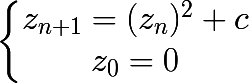
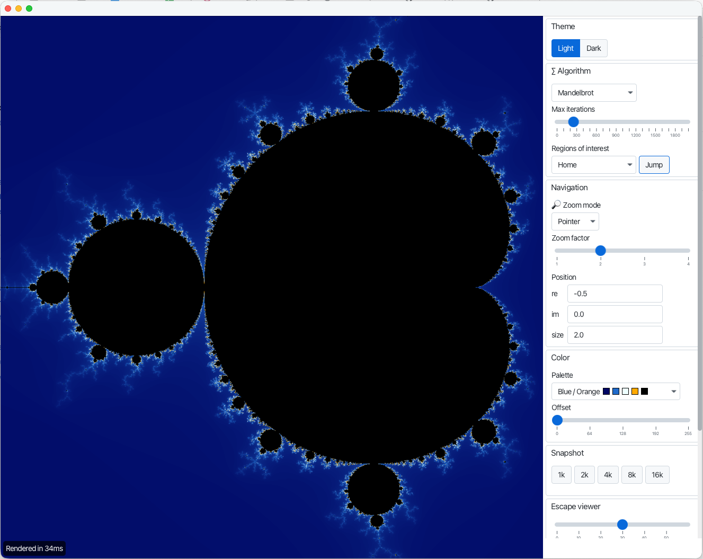
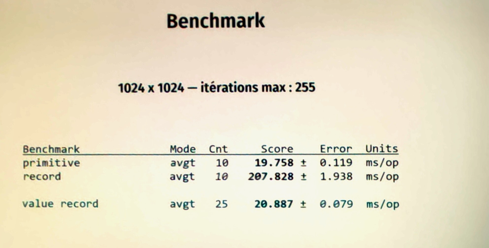
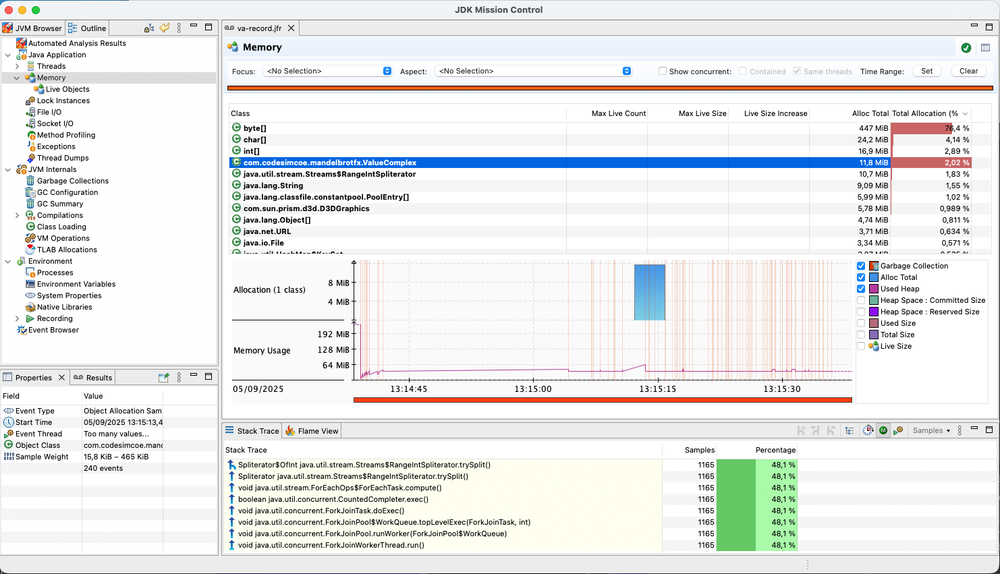
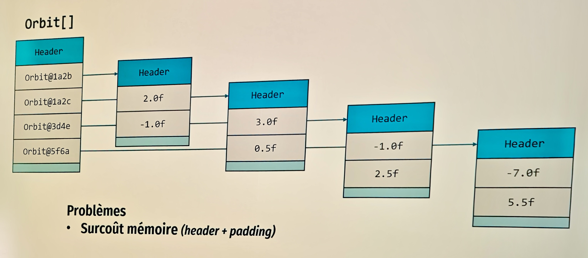
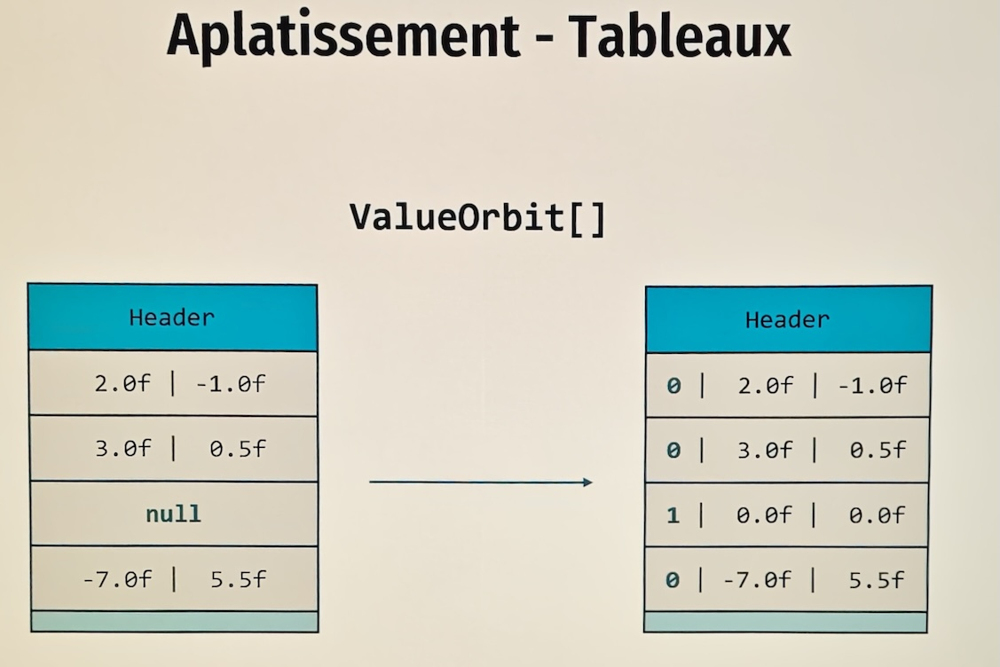
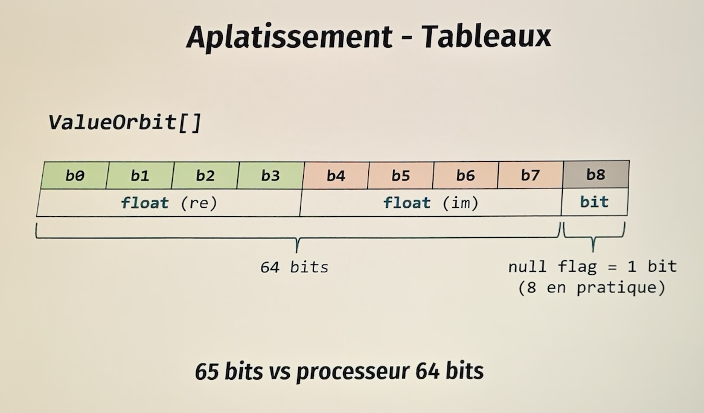
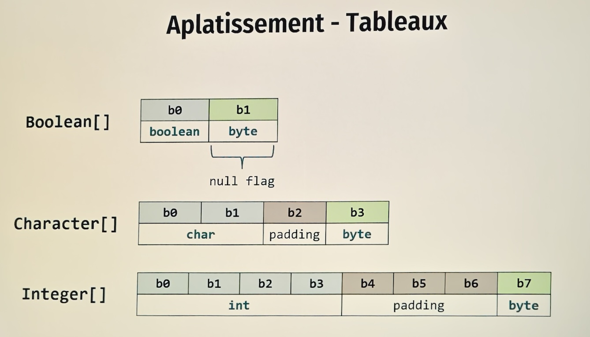
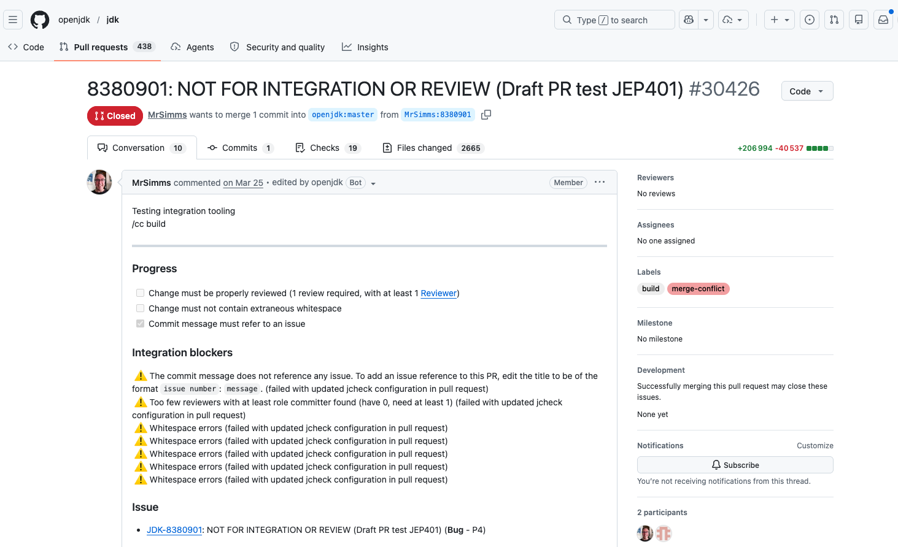

Conférence : [Devoxx France 2026](https://www.devoxx.fr/)<br>
Date : 24 avril 2026<br>
Speakers : Clément de Tastes (SCIAM) et Rémi Forax (Université Gustave Eiffel)<br>
Format : conférence (45 min)<br>
Repository GitHub : [mandelbrot-valhalla](https://github.com/CodeSimcoe/mandelbrot-valhalla/tree/devoxxfr)

Ce talk sur le **futur de Java** commence par nous plonger dans l'univers des **fractales**.

## Les fractales

Le [chou-fleur romanesco](https://fr.wikipedia.org/wiki/Chou_romanesco) est une structure fractale :
son motif se répète quel que soit le niveau de zoom.

Clément a développé l'application JavaFX [MandelbrotFx](https://github.com/CodeSimcoe/MandelbrotFx)
permettant d'afficher des fractales, dont la plus connue est très certainement
la [fractale de Mandelbrot](https://fr.wikipedia.org/wiki/Ensemble_de_Mandelbrot),
définie par la suite mathématique suivante :


Voici une capture d'écran de la fractale de Mandelbrot depuis MandelbrotFx :


Implémentation Java extraite de
[MandelbrotFractal.java](https://github.com/CodeSimcoe/MandelbrotFx/blob/main/src/main/java/com/codesimcoe/mandelbrotfx/fractal/MandelbrotFractal.java)
utilisant les **types primitifs** `double` et `int` :

```java

@Override
public int computeEscape(double re0, double im0, int max) {

    double re = 0;
    double im = 0;

    // Squared values
    double re2 = 0;
    double im2 = 0;
    double modulus2 = 0;

    // Iteration
    int i = 0;

    while (modulus2 <= 4 && i < max) {
        im = 2 * re * im + im0;
        re = re2 - im2 + re0;
        re2 = re * re;
        im2 = im * im;
        modulus2 = re2 + im2;
        i++;
    }

    return i;
}
```

Efficace, cette implémentation est relativement difficile à comprendre.
Pour améliorer sa maintenance, on peut utiliser des **`record`** en définissant le type
[Complex](https://github.com/CodeSimcoe/mandelbrot-valhalla/blob/devoxxfr/src/main/java/com/codesimcoe/mandelbrotfx/Complex.java) :

```java
public record Complex(double re, double im) {
    public static final Complex ZERO = new Complex(0, 0);

    public double magnitudeSquared() {
        return this.re * this.re + this.im * this.im;
    }

    public Complex square() {
        return new Complex(this.re * this.re - this.im * this.im, 2 * this.re * this.im);
    }


    public Complex add(Complex other) {
        return new Complex(this.re + other.re, this.im + other.im);
    }
}
```

```java
@Override
public int computeEscape(double re0, double im0, int max) {
    Complex c = new Complex(re0, im0);
    Complex z = Complex.ZERO;
    int i = 0;

    while (z.magnitudeSquared() < 4 && i < max) {
        z = z.square().add(c);
        i++;
    }

    return i;
}
```

Plus propre, cette implémentation est cependant dix fois plus gourmand en ressources qu'avec les primitives. Beau, mais cher.
C'est là qu'entre en jeu le sujet du talk : les **Value Types**.

## API Value Types

Disclaimer de Rémi : à date du 24 avril 2026, l'API Value Types peut encore évoluer, car elle n'est pas encore sortie.

Le **[projet Valhalla](https://openjdk.org/projects/valhalla/)** d'OpenJDK a démarré en 2014, juste après la sortie de Java 8.

Son objectif : ne plus avoir à choisir entre **code lisible** et **performance**, et s'affranchir du coût des classes.
À ce jour, en avril 2026, ce refactoring est toujours en cours.

Citation du Java Language Architect [Brian Goetz à Devoxx Belgium 2024](https://inside.java/2024/12/16/devoxxbelgium-valhalla/) :
> Java's epic refactor

Les concepteurs de Java ne veulent pas casser le code existant, afin d'éviter ce qui s'est passé avec Python.
Leur objectif est d'enrichir le langage Java avec des value objects.

Seconde citation de Brian Goetz :
> Code like a class, works like an int

Les value objects promettent le meilleur des deux mondes :

- **Combiner** l'**abstraction de la POO** avec les **performances des types primitifs**.
- **Combler le fossé** entre les **types primitifs** et les **objets**.

Le projet Valhalla est conduit dans la **[JEP 401 : Value Classes and Objects (Preview)](https://openjdk.org/jeps/401)**.
Au 25 avril 2026, la JEP est au statut **Submitted** et n'est pas encore intégrée officiellement dans OpenJDK.

Avant de se pencher sur les value classes, un rappel sur les deux espaces mémoire coexistants en Java :

**Stack** (la pile) :

- Utilisée pour exécuter des méthodes
- Chaque appel de méthode pousse une nouvelle frame sur la pile
- Stocke les variables locales

**Heap** (le tas) :

- Utilisé pour le stockage des objets (instances de classes)
- Chaque `new` alloue de l'espace mémoire pour l'objet et son header
- Stocke les champs (par multiple de 8 bits)

Les **types primitifs** sont stockés directement sur la stack.

L'objectif des architectes du langage Java est de réconcilier classe et type primitif
en introduisant temporairement une 3ᵉ sorte de type, les **value objects**.
Les value objects sont un mélange entre les classes et les types primitifs :

| Classes                                                               | Value Classes                                                         | Primitifs                                                                                                                |
|-----------------------------------------------------------------------|-----------------------------------------------------------------------|:-------------------------------------------------------------------------------------------------------------------------|
| Identité                                                              | **Pas d'identité**                                                    | **Pas d'identité**                                                                                                       |
| Champs, méthodes, peuvent implémenter des interfaces<br>Encapsulation | Champs, méthodes, peuvent implémenter des interfaces<br>Encapsulation |                                                                                                                          |
|                                                                       | **Aplatis sur la stack**<br>Peuvent être aplatis sur le heap          | **Aplatis sur la stack** et la heap                                                                                      |
| Instances nullables                                                   | Instances peuvent être nullables                                      |                                                                                                                          |
| Intégrité                                                             | Peuvent ne pas avoir d'intégrité                                      | Peut ne pas avoir d'intégrité ([long/double CPU 32 bits](https://docs.oracle.com/javase/specs/jls/se8/html/jls-17.html)) |

En Java, les types primitifs sont aplatis sur la stack et la heap : on utilise directement les valeurs,
jamais de pointeur (contrairement à Python, où les types primitifs sont manipulés avec des pointeurs).

Avec les Value Classes, sur la pile, on manipule directement les valeurs,
alors qu'au niveau du langage Java, cela reste des références qui ne sont plus des pointeurs.

Stockées sur la heap, les classes Java sont intègres.
On ne peut pas voir la moitié de la valeur, contrairement aux types primitifs sur 64 bits.
Pour des raisons de performance, les Value Classes pourraient ne pas garantir l'intégrité.

Rémi Forax évoque qu'à très long terme, peut-être dans 10 ans, on pourrait envisager de supprimer les types primitifs du langage Java.

Les Value Classes viennent avec le **nouveau mot-clé `value`**.  
Ce mot-clé permet de définir une **`value class`** ou un **`value record`**. On renonce alors à l'identité.

## Benchmark

Pour tester les Value Classes, Clément et Rémi ont créé le fork
[**mandelbrot-valhalla**](https://github.com/CodeSimcoe/mandelbrot-valhalla)
construit autour de la branche [bworld](https://github.com/openjdk/valhalla/tree/bworld)
du [projet Valhalla d'OpenJDK](https://github.com/openjdk/valhalla) basé sur **Java 27**.

Dans le code, le seul changement consiste à remplacer `record` par `value record`.  
Le microbenchmark JMH
[PrimitiveRecordValueBenchmark](https://github.com/CodeSimcoe/mandelbrot-valhalla/blob/devoxxfr/src/main/java/com/codesimcoe/mandelbrotfx/benchmark/PrimitiveRecordValueBenchmark.java)
montre que l'implémentation avec les `value record` se rapproche beaucoup du temps d'exécution des primitives.


L'enregistrement Java Flight Recorder (JFR)
[va-record.jfr](https://github.com/CodeSimcoe/mandelbrot-valhalla/blob/devoxxfr/va-record.jfr),
lu avec l'outil [JDK Mission Control](https://www.oracle.com/java/technologies/jdk-mission-control.html),
apporte des précisions :

- Benchmark avec **primitif** : rien de particulier
- Benchmark avec **record** : allocation de **107 Go d'instances** du record `Complex` + utilisation massive du Garbage
  Collector
- Benchmark avec **value records** : on se rapproche des types primitifs.
  Seulement **11 Mo d'allocations** d'objets `Complex`. Des optimisations sont faites par la VM.
  Les premières allocations mémoire sont faites par l'interpréteur Java.
  Lorsque les deux JIT entrent en jeu, la JVM optimise les allocations en injectant du code assembleur.
  Le processus de scalarisation de la JVM place les valeurs des champs dans les registres
  (les champs des value record ne sont pas modifiables).



Rémi précise que les value objects ne se limitent pas à l'optimisation et à l'amélioration des performances.
Ils ont d'autres champs d'application et impacteront, par exemple, l'écriture des **Builder** habituellement mutables.
Des changements sont à prévoir dans la manière d'écrire du code Java :
on pourra désormais avoir plein de petits objets non mutables.

Pour illustrer les spécificités des value objects, notamment au niveau de leur identité,
Rémi et Clément ont préparé la classe de démo
[03_Properties.java](https://github.com/CodeSimcoe/mandelbrot-valhalla/blob/devoxxfr/src/main/java/demo/_03_Properties.java) :

```java
value record

ValueComplex(double re, double im) {
}

// JEP 512 : Compact Source Files and Instance Main Methods
void main() {
    IO.println("JDK version : " + Runtime.version());

    var c1 = new ValueComplex(2, -1);
    var c2 = new ValueComplex(2, -1);
    IO.println(c1);

    IO.println("isValue : " + c1.getClass().isValue());
    IO.println("isIdentity : " + c1.getClass().isIdentity());

    // true car ce sont les valeurs qui sont comparées.
    // La comparaison est récursive pour les champs qui sont eux-mêmes des value objects.
    // En revanche, un champ de type String reste comparé par identité avec ==
    IO.println("c1 == c2 : " + (c1 == c2));

    IO.println("==============");

    // Méthode identityHashCode valeur par défaut généré 
    // si le dév ne déclare pas de Hashcode
    IO.println(System.identityHashCode(c1));
    IO.println(System.identityHashCode(c2));

    IO.println("==============");

    IO.println(System.identityHashCode(new Object()));
    IO.println(System.identityHashCode(new Object()));

    // Ne compile pas car le compilateur attend une identité
    synchronized (c1) {
    }

    Object o1 = c1;
    // Lève au runtime une IdentityException
    synchronized (o1) {
    }
}
```

## Initialisation stricte dans le constructeur

Disponible depuis **Java 25**, la **[JEP 513 : Flexible Constructor Bodies](https://openjdk.org/jeps/513)**
permet désormais d'initialiser les champs d'un constructeur avant l'appel à `this` ou `super`.  
Les value classes s'appuient sur ces travaux.
Lorsque le constructeur d'une value class ne contient pas d'appel explicite au constructeur,
un appel implicite est fait à la fin du corps du constructeur, et non au début.
Dans un constructeur, on retrouve désormais un **prologue** (section avant l'appel à `this` ou `super`)
et un **épilogue** (section après l'appel à `this` ou `super`).

La classe `SafeComplex` de la démo
[04_StrictInit.java](https://github.com/CodeSimcoe/mandelbrot-valhalla/blob/80cbde9789c0af60a2a6594cba2534e5be4e79ae/src/main/java/demo/_04_StrictInit.java)
illustre les changements à apporter au niveau du constructeur lorsqu'on transforme une `class` en `value class` :

```java
/* value */ class SafeComplex {

    private final double re;
    private final double im;

    // JEP 513 : Flexible Constructor Bodies
    public SafeComplex(double re, double im) {

        // Prologue
        // Can initialize field or perform checks
//      this.re = re;
//      this.im = im;

        // Cannot reference 'this' before superclass constructor is called
//      this.prettyPrint();

        super();

        // Validation
        if (Double.isNaN(re)) {
            throw new IllegalArgumentException("re is NaN");
        }
        if (Double.isNaN(im)) {
            throw new IllegalArgumentException("im is NaN");
        }

        // Epilogue
        // "this" becomes available

        // strict field re is not initialized before the supertype constructor has been called
        this.re = re;
        this.im = im;

        this.prettyPrint();
    }

    void prettyPrint() {
        IO.println("re = " + this.re + ", im = " + this.im);
    }
}
```

Lorsqu'on transforme la classe `SafeComplex` en `value class`,
l'initialisation de ses propriétés `re` et `im` doit être remontée dans le prologue,
avant l'appel à `super();`.

Afin d'être prêts pour les value types, Rémi Forax contraint ses étudiants à coder leur constructeur ainsi.
Mon voisin Judicaël acquiesce.

## Changements dans le JDK

Rémi poursuit en rappelant qu'il existe une notion de
[Value-based classes](https://docs.oracle.com/en/java/javase/21/docs/api/java.base/java/lang/doc-files/ValueBased.html)
dans le JDK.
Les classes basées sur des valeurs (comme `java.lang.Integer`, `java.util.Optional` ou `java.time.LocalDate`)
sont définies par leurs données internes immuables,
et leurs méthodes (`equals`, `hashCode`, `toString`) reposent uniquement sur ces valeurs, pas sur l'identité des objets.
Deux instances égales doivent être considérées comme interchangeables, sans impact sur le comportement du programme,
et il ne faut pas chercher à les distinguer par leur référence ou d'autres mécanismes liés à l'identité.
Enfin, ces classes sont conçues pour éviter l'usage de la synchronisation (`synchronized`) et de l'identité unique,
et leur comportement lié à l'identité pourrait évoluer dans le futur.

À long terme, un sous-ensemble précis de Value-based classes du JDK, annotées avec `@jdk.internal.ValueBased`, pourra être migré en `value class`.
La JEP 401 cite notamment certains wrappers de `java.lang`, `Optional` et une liste déterminée de types de `java.time`.

L'auto-boxing devrait alors avoir beaucoup moins de surcoût dans certains cas, mais pas dans tous :
l'effacement de type des génériques ou du code non recompilé pourraient encore limiter les optimisations.  
Pour les wrappers effectivement migrés, l'opérateur `==` pourra alors bien plus souvent refléter
l'égalité attendue ; les différentes représentations de [Not-a-Number (NaN)](https://www.baeldung.com/java-not-a-number)
restant un cas particulier.

Depuis Java 16, suite à la [JEP 390: Warnings for Value-Based Classes](https://openjdk.org/jeps/390),
le compilateur génère un warning lorsqu'un `synchronized` est fait sur un type Wrapper.

Ces changements dans le JDK pourront profiter au code legacy, et la compatibilité binaire reste un objectif important.
Nos vieilles librairies Java seront ainsi automatiquement optimisées lorsque Valhalla sortira.
En revanche, pour bénéficier pleinement des optimisations, il pourra être nécessaire de recompiler le code existant :
les métadonnées `LoadableDescriptors` des class files aident en effet la JVM à appliquer plus facilement l'aplatissement
et la scalarisation quand des Value Classes apparaissent dans des signatures.

## Tableaux

Avant de terminer, les speakers reviennent sur la gestion mémoire des tableaux d'objets.
Chaque objet référencé dans un tableau possède un header, les données de l'objet
et éventuellement des octets d'alignement (le padding).  
Dans le schéma ci-dessous, le tableau de 4 objets de type `Orbit` contenant 8 `float` a un surcoût mémoire en heap :



À ce surcoût mémoire s'ajoute une lenteur à l'exécution lors de la lecture du tableau,
car le CPU doit suivre les pointeurs.
Les objets peuvent malheureusement être dispersés en RAM.
Ce phénomène est connu sous le nom de **pointer chasing**.
Grâce au JIT de Java, les dégradations sont moins coûteuses qu'en C.

En convertissant la `class Orbit` en `value class Orbit`,
la JVM pourra profiter du mécanisme d'aplatissement permettant de compacter l'espace mémoire.
Sans identité, les headers de chaque objet disparaissent.


Java permet de mettre `null` dans un tableau de références, y compris un tableau de value objects.
Cela complique l'aplatissement : il faut distinguer un élément nul d'un élément non nul.

En pratique, ce n'est pas seulement "1 bit en plus". La représentation mémoire doit aussi respecter la taille de mot,
l'atomicité des lectures et écritures, et les contraintes d'alignement de la plateforme.


Ces contraintes expliquent pourquoi certains layouts compacts restent délicats.
Par exemple, un tableau conceptuel de `Character[]` aplati nécessiterait probablement du padding ou une autre stratégie de stockage.
En effet, les CPU ne savent pas lire 24 bits.



Pour traiter proprement ce sujet, les JEP en drafts [Null-Restricted and Nullable Types](https://openjdk.org/jeps/8303099)
et [Null-Restricted Value Class Types](https://openjdk.org/jeps/8316779) distinguent deux niveaux :
1. Le premier introduit des marqueurs de nullité dans le système de types,
avec la syntaxe pressentie "bang" `!` pour un type null-restricted,
    et `?` pour un type explicitement nullable.
2. Le second exploite cette information pour permettre des stockages plus compacts
    pour certains Value Class types, avec des notions supplémentaires comme les "zero instances"
    et l' "implicit constructor".

Dans la continuité de [JSpecify](https://jspecify.dev/), la syntaxe exacte peut encore évoluer, mais l'idée est bien de pouvoir exprimer qu'une valeur,
par exemple `Boolean! bool1`, ne peut pas être `null`.

## Conclusion

De cette conférence, 3 points sont à retenir sur les Value Types :

- Encapsulation (POO) **et** performance des primitives Java
- Pas seulement une amélioration des performances
- Permet de rapprocher objets et types primitifs

L'introduction des Value Types a nécessité plusieurs JEP. Certaines sont déjà sorties, d'autres viendront au fil des
releases de Java.

Intégrer la JEP 401 des Value Types dans OpenJDK est à ce jour **le plus gros refactoring** connu par Rémi.
Contributeur sur le projet Valhalla, **MrSimms** s'est prêté à l'exercice via la
PR [#30426](https://github.com/openjdk/jdk/pull/30426) :
**206 994 lignes de code ajoutées**, **40 537 lignes supprimées**, le tout sur **2 665 fichiers**.


## Références

### Spécifications OpenJDK

- [JEP 401 : Value Classes and Objects (Preview)](https://openjdk.org/jeps/401) — spécification principale des value classes et value objects
- [JEP 402 : Enhanced Primitive Boxing (Preview)](https://openjdk.org/jeps/402) — amélioration du boxing vers les value objects
- [JEP 390 : Warnings for Value-Based Classes](https://openjdk.org/jeps/390) — avertissements du compilateur pour les usages d'identité (Java 16)
- [JEP 513 : Flexible Constructor Bodies](https://openjdk.org/jeps/513) — initialisation stricte des constructeurs avant `super()` (Java 25)
- [JEP 512 : Compact Source Files and Instance Main Methods](https://openjdk.org/jeps/512) — simplification du point d'entrée des programmes Java
- [Draft JEP 8303099 : Null-Restricted and Nullable Types](https://openjdk.org/jeps/8303099) — marqueurs de nullité dans le système de types
- [Draft JEP 8316779 : Null-Restricted Value Class Types](https://openjdk.org/jeps/8316779) — stockage compact des value classes sans null

### Documentation OpenJDK

- [Projet Valhalla](https://openjdk.org/projects/valhalla/) — page officielle du projet OpenJDK
- [Value Classes and Objects — page projet Valhalla](https://openjdk.org/projects/valhalla/value-objects) — notes de performance, compatibilité et liens vers l'EA build
- [Value-based classes (JDK docs)](https://docs.oracle.com/en/java/javase/21/docs/api/java.base/java/lang/doc-files/ValueBased.html) — définition des classes value-based dans le JDK

### Code source

- [mandelbrot-valhalla (branche devoxxfr)](https://github.com/CodeSimcoe/mandelbrot-valhalla/tree/devoxxfr) — code de la démonstration présentée à Devoxx France 2026
- [MandelbrotFx](https://github.com/CodeSimcoe/MandelbrotFx) — application JavaFX originale de Clément de Tastes
- [OpenJDK Valhalla (branche bworld)](https://github.com/openjdk/valhalla/tree/bworld) — branche OpenJDK utilisée pour le benchmark (Java 27)
- [PR #30426 — intégration de la JEP 401 dans OpenJDK](https://github.com/openjdk/jdk/pull/30426) — 206 994 lignes ajoutées sur 2 665 fichiers

### Autres ressources

- [Brian Goetz à Devoxx Belgium 2024 — Java's epic refactor](https://inside.java/2024/12/16/devoxxbelgium-valhalla/) — vision et motivations du projet Valhalla
- [Présentation de Frederic Parain au JVM Language Summit 2025](https://www.youtube.com/watch?v=NF4CpL_EWFI) — détails sur les optimisations de performance (flattening, scalarisation)
- [JSpecify](https://jspecify.dev/) — spécification d'annotations de nullité pour Java, contexte des types null-restricted


