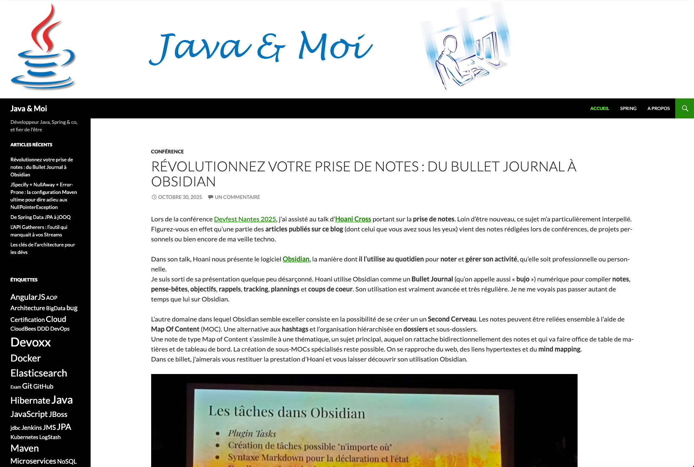
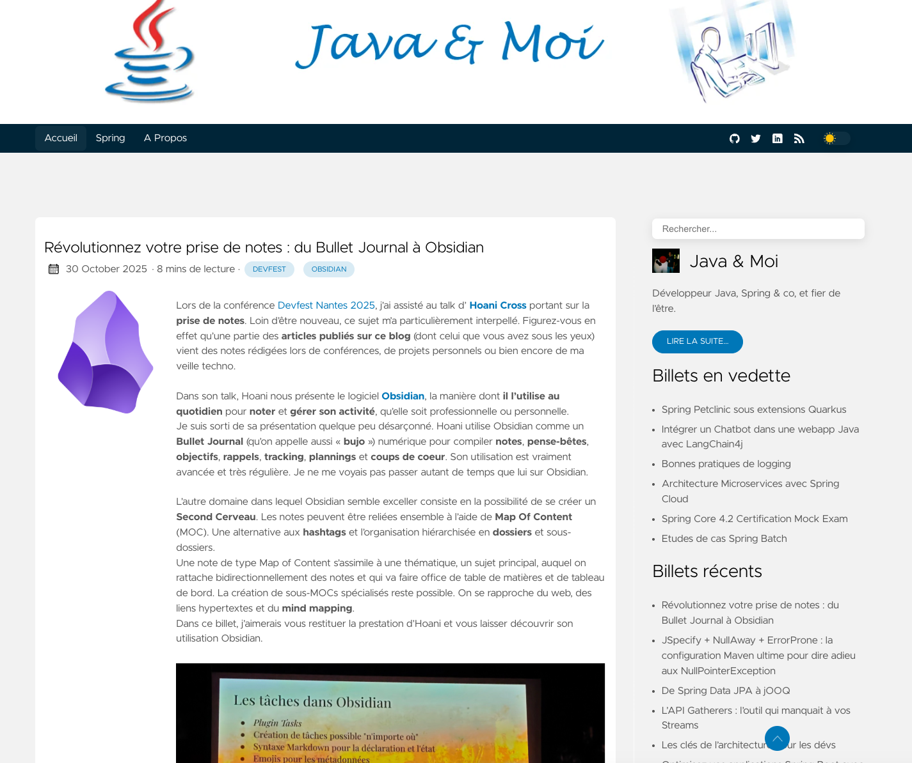
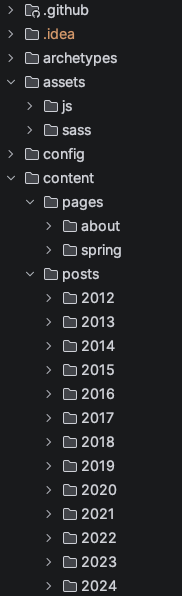
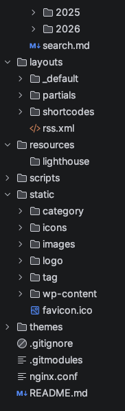

Après **14 ans** de bon et loyaux services **sous WordPress**, en avril 2026, j'ai migré mon blog **[Java & Moi](https://javaetmoi.com/)** 
vers **[Hugo](https://gohugo.io/)**, un générateur de sites statiques écrit en **Go**.

En deux semaines, les **114 articles** ont été migrés.
L'outil **[wp2hugo](https://github.com/ashishb/wp2hugo)** a servi de point de départ, puis **GitHub Copilot** m'a accompagné pour finaliser cette migration : 
génération de scripts de migration, rattrapage de données, personnalisation du thème Hugo et correction de bugs.

Dans ce billet, je vous propose un retour d'expérience sur cette migration : les motivations, les étapes, les écueils rencontrés et le résultat final.

Blog Java & Moi sous WordPress avant la migration :


Blog Java & Moi après la migration vers Hugo :


<!--more-->

## Pourquoi quitter WordPress ?


Le blog Java & Moi existe depuis **février 2012**. À l'époque, WordPress s'imposait comme la plateforme de blogs de référence.
Je l'avais choisi par facilité, sans trop me poser de question sur le choix de la stack technique.
Durant toutes ces années, j'en ai été très satisfait. Mon seul reproche était peut-être de devoir être en ligne pour rédiger le draft de mes articles.
Profitant de mes longs trajets en TER traversant des zones blanches (pas de télétravail à l'époque), je rédigais mon article 
dans un document Word que j'importais ensuite dans WordPress via un plugin.
C'était un peu fastidieux, mais ça fonctionnait.

Fin 2025, j'ai assisté à une formation d'éco-conception de service numérique animée par Frédéric Bordage.
Lorsque Frédéric a évoqué la JAMStack et les **sites statiques**, j'ai eu un déclic : pourquoi continuer à utiliser WordPress alors que je n'avais pas besoin de toutes ses fonctionnalités ?
Mon site est un simple **blog** : je publie des articles techniques à destination des développeurs.
La seule fonctionnalité avancée était probablement celle des commentaires intégrés.

Au cours de ma veille technologique, j'étais déjà tombé sur des auteurs de blogs qui avaient démarré ou migré sur des technos plus récentes de type site statique.
Je repense par exemple à **David Lacourt** qui avait créé [son blog lacourt.dev](https://lacourt.dev/) en 2019 sur **[Gatsby](https://www.gatsbyjs.com/docs/)** puis rapidement migré vers **Sapper** puis **[SvelteKit](https://svelte.dev/docs/kit/introduction)**. 
Ou bien encore à **Brice Dutheil** qui nous expliquait en 2020 avoir migré [son blog arkey](https://blog.arkey.fr/) de **WordPress** vers **[Jekyll](https://jekyllrb.com/)** puis **[Hugo](https://gohugo.io/)**.
L'an dernier, **Adrien Garandel** a commencé [son blog Dralagen](https://dralagen.fr/) sur **[Quartz 5](https://quartz.jzhao.xyz/)** dont je n'avais jamais entendu parler.

Un autre fait marquant de 2025 fut ma découverte du logiciel **Obsidian** dont je vous ai déjà parlé dans mon précédent billet 
[Révolutionnez votre prise de notes : du Bullet Journal à Obsidian](/2025/10/revolutionnez-votre-prise-de-notes-du-bullet-journal-a-obsidian/).
J'utilise désormais Obsidian pour organiser mes notes personnelles. Le format natif des notes d'Obsidian est le **Markdown**.
Pouvoir facilement exploiter mes notes Obsidian en markdown vers un billet de blog en markdown me simplifierait la vie.

Dernier point, les **LLM** parlent couramment le markdown. Même si je tiens à écrire personnellement (ou presque) chaque phrase de mes articles, 
cela m'arrive fréquemment de faire appel aux LLM pour des corrections orthographiques, des reformulations, l'ajout des méta-données ou bien 
encore la génération d'illustrations.

## Le choix de Hugo

Mon site WordPress était hébergé sur un serveur mutualisé OVH.

Pour limiter les frais d'hébergement et me simplifier la vie, je voulais utiliser les **[GitHub Pages](https://docs.github.com/fr/pages)** pour héberger mon blog.
Lorsque le repo GitHub est public, l'hébergement est **gratuit**. Et pour un blog personnel à faible trafic (100 vues par jour), c'était suffisant.
Le choix de Hugo s'est rapidement imposé à moi. Réputé pour sa rapidité, le résultat est sans appel : pour générer 623 pages, 
le temps de build en local sur mon Macbook est de l'ordre de la seconde (environ 800 ms à 1,8 s selon le cache).

J'avais déjà eu une expérience personnelle avec Jekyll que j'avais utilisé en 2018 pour créer le site de [l'organisation Spring Petlcinic](https://spring-petclinic.github.io/).
Je voulais changer. L'écosystème de Hugo est mature et complet : thèmes, modules, shortcodes, templating, multilingue (si un jour je décidais de traduire mes articles), catégories, taxonomies, tags ...

En ce qui concerne le thème, j'ai choisi **[Hugo Clarity](https://github.com/chipzoller/hugo-clarity)** (celui par Chip Zoller) pour son design épuré, 
la gestion des tags et catégories, sa table des matières en sidebar, sa gestion des images et sa barre de recherche intégrée.

Dans les paragraphes suivants, je vous détaille les principales étapes de la migration.


## Étape 1 - Conversion initiale avec wp2hugo

L'outil **[wp2hugo](https://github.com/ashishb/wp2hugo)** convertit un export WordPress (fichier XML + téléchargement de média) en un site Hugo.
Il génère :

- Un fichier Markdown par article avec le front matter YAML (titre, date, catégories, tags)
- Les métadonnées WordPress (`post_id`, `guid`, `_edit_last` ...) préservées dans le front matter
- Les images référencées dans les articles, téléchargées dans `static/wp-content/uploads/` (que j'ai ensuite déplacées dans les pages bundles).

Le résultat brut de wp2hugo a ensuite nécessité un travail de nettoyage et de reformatage conséquent.
Comme bien souvent, ces outils de conversion automatique font le gros du travail (ici sans doute 90 %).
Mais des tâches manuelles restent à effectuer pour corriger les imperfections et les artefacts de la conversion automatique :

- **Tableaux HTML** mal formatés, convertis ensuite en syntaxe Markdown
- **Blocs de code** avec des balises de langage incorrectes ou vides
- **Doubles accolades** `{{ }}` générées par wp2hugo pour les sauts de ligne et remplacées par des `<br>`
- **Liens hypertextes** cassés dans les résumés
- **Chemins d'images** `wp-content/uploads/` à corriger (URLs relatives et absolues)

## Étape 2 - Configuration du thème Hugo Clarity

L'installation du thème **[Hugo Clarity](https://github.com/chipzoller/hugo-clarity)** a été réalisée à l'aide d'un **submodule Git**. Bien pratique.

Le paramétrage du thème a lieu dans les différents fichiers [TOML](https://fr.wikipedia.org/wiki/TOML) localisés au niveau du répertoire `config/_default/` :
- Nom du site et activation du flux RSS dans `hugo.toml`
- Menus et liens vers les réseaux sociaux (GitHub, Twitter/X, LinkedIn) dans `menus/menu.fr.toml` 
- Activation de la **barre de recherche**, de la **table des matières** et des **billets en vedette** dans `params.toml`

L'adaptation du thème Hugo Clarity a ensuite été réalisée pour :
- Ajouter le **bandeau Java & Moi** au-dessus de la barre de navigation, avec un override partiel du header dans `layouts/partials/header.html` et un ajustement du CSS dans `assets/sass/_custom.sass`
- Personnaliser la **sidebar** avec les widgets **Devoxx France** et **Blogs Java**, via un override partiel du sidebar dans `layouts/partials/sidebar.html`
- Configurer le **favicon** ☕ (très important)

## Étape 3 - Restructuration du contenu

### Organisation en page bundles

WordPress stockait toutes les images dans le sous-répertoire `wp-content/uploads/YYYY/MM/`.


Dans Hugo, j'ai adopté les **[page bundles](https://gohugo.io/content-management/page-bundles/)** sur la majorité des posts :
chaque article qui référence des images devient un répertoire contenant un `index.md` (contenu de l'article) et ses images co-localisées.

Généré par GitHub Copilot, le script shell [`migrate_to_page_bundles.sh`](https://github.com/arey/javaetmoi/blob/v1.0.0/scripts/migrate_to_page_bundles.sh) automatise cette conversion :

1. Création du répertoire du bundle
2. `git mv` du fichier `.md` vers `index.md` (pour préserver l'historique Git)
3. Copie des images depuis `static/wp-content/` vers le bundle
4. Remplacement des chemins `wp-content/uploads/...` par le nom du fichier seul
5. Correction des chemins d'images dans le `summary` (chemins absolus requis pour le rendu sur la page d'accueil)
6. Ajout de `usePageBundles: true` dans le front matter Markdown

Au final, **93 articles** utilisent des pages bundles et **21 articles** sans images restent en fichiers `.md` plats.

Je conserve volontairement ce script pour les lecteurs de ce billet qui souhaiteraient migrer leur blog WordPress vers Hugo.

### Organisation par année

Les 114 articles ont été déplacés dans des sous-répertoires correspondant à leur année de publication (ex: `content/posts/2012/`, `content/posts/2026/`).
Une organisation qui me facilite la navigation dans le "code source".

## Étape 4 - Relecture des articles

Chaque article a été (ou sera) relu individuellement pour corriger les artefacts de cette migration automatique :

- Remplacement de la syntaxe `` par la syntaxe Markdown standard ``
- Conversion de la syntaxe de code inline (backticks Markdown)
- Vérification des images de couverture (`featureImage`) et des miniatures (`thumbnail`)
- Nettoyage des résumés multi-lignes dans le front matter
- Mise à jour des descriptions d'images pour l'**accessibilité** (attribut `alt`)

## Étape 5 - Migration des commentaires vers Giscus

WordPress stockait les commentaires en base de données MySQL.

Pour un site statique, il faut nécessairement une solution externe.
Mon choix s'est porté sur **[Giscus](https://giscus.app/)** qui utilise (détourne ?) les **GitHub Discussions** pour stocker les commentaires.

Le script Python [`import_comments_to_giscus.py`](https://github.com/arey/javaetmoi/blob/v1.0.0/scripts/import_comments_to_giscus.py) a été généré pour automatiser l'import :
- Lecture des commentaires exportés depuis WordPress (fichier YAML)
- Création d'une **GitHub Discussion** par article via l'API GraphQL de GitHub
- Import de chaque commentaire en tant que **réponse** à la discussion, avec le nom de l'auteur original et la date
- Support des **réponses imbriquées** (commentaires de commentaires)
- Mécanisme de **reprise sur erreur** grâce à un fichier d'état JSON (`import_state.json`)

Au total, **175 commentaires** ont été importés dans **44 discussions** GitHub. 
Seul bémol : les commentaires sont postés en mon nom d'utilisateur GitHub et non pas au nom de l'auteur original. 

Une fois encore, je conserve volontairement ce script pour les lecteurs de ce billet qui souhaiteraient migrer leurs commentaires WordPress vers Giscus.

## Étape 6 - Redirections des URLs WordPress

Un blog de 14 ans, c'est des centaines d'URLs indexées par Google. Je me suis assuré qu'aucun lien existant ne se retrouve en 404.

### URLs des articles

Les URLs des articles ont été conservées à l'identique grâce au champ `url` du front matter Hugo :

```yaml
url: /2025/06/de-spring-data-jpa-a-jooq/
```

### Taxonomies

Quelques adaptations ont été nécessaires.
WordPress utilisait `/tag/` et `/category/` (singulier) tandis que Hugo utilise `/tags/` et `/categories/` (pluriel).
De plus, WordPress supprimait les accents des slugs de catégories alors que Hugo les conserve.

Le script Python [`generate_wordpress_taxonomy_redirects.py`](https://github.com/arey/javaetmoi/blob/main/scripts/generate_wordpress_taxonomy_redirects.py) génère des **pages de redirection statiques** HTML avec `<meta http-equiv="refresh">` :

```html
<meta http-equiv="refresh" content="0; url=/categories/retour-dexpérience/">
```
GitHub Pages ne supportant pas les redirections côté serveur (pas de `.htaccess` ni de `nginx.conf`), ces pages HTML de redirection côté cliente représentent la seule option que j'ai trouvées. 
Je suis preneur de toute suggestion pour améliorer ce mécanisme.

## Étape 7 - Déploiement sur GitHub Pages

Le déploiement a été configuré via le **workflow GitHub Actions** [hugo.yaml](https://github.com/arey/javaetmoi/blob/v1.0.0/.github/workflows/hugo.yaml).
À chaque Git push sur la branche `main`, le workflow :

1. Clone le repository avec le submodule du thème
2. Installe Hugo Extended (requis pour la compilation SASS)
3. Exécute `hugo --minify` pour générer le site dans le répertoire `public/`
4. Déploie le contenu sur GitHub Pages

L'URL du site était temporairement accessible sur [https://arey.github.io/javaetmoi/](https://arey.github.io/javaetmoi/).


## Étape 8 - Changement de DNS

La dernière étape a été de reconfigurer les enregistrements DNS du domaine `javaetmoi.com` hébergé chez OVH pour pointer vers GitHub Pages.

Avant de pouvoir utiliser le nom de domaine `javaetmoi.com`, GitHub exige une vérification de propriété via un enregistrement **TXT** 
dédié (`_github-pages-challenge-arey.javaetmoi.com`) généré depuis les paramètres du repository.
Sans ce pré-requis, GitHub refusera d'associer le domaine au site.

Vient ensuite la configuration des enregistrements DNS.
Un domaine apex (sans sous-domaine) comme `javaetmoi.com` ne peut pas utiliser un simple **CNAME**.
On doit d'abord faire le lien entre le domaine et une adresse IP.
GitHub Pages impose de déclarer **4 enregistrements A** pointant vers ses adresses IP officielles (bien mettre les 4 adresses, pas seulement la première comme j'avais fait initialement) :
```text
185.199.108.153
185.199.109.153
185.199.110.153
185.199.111.153
```

On peut ensuite faire le lien entre un nom de domaine `www.javaetmoi.com` et un autre nom de domaine `arey.github.io` via un enregistrement **CNAME**.

La [documentation de GitHub Pages](https://docs.github.com/en/pages/configuring-a-custom-domain-for-your-github-pages-site/managing-a-custom-domain-for-your-github-pages-site) détaille cette procédure complète.

Après propagation DNS (constaté personnellement au bout de quelques minutes mais possiblement jusqu'à 24h), le certificat HTTPS est généré automatiquement par GitHub et
l'URL `https://arey.github.io/javaetmoi/` redirige désormais vers `https://javaetmoi.com/`.


## Le rôle de GitHub Copilot


En tant que développeur Open Source, Microsoft m'accorde gracieusement une licence GitHub Copilot Pro.
J'ai profité d'une semaine de congés pour me lancer dans ce travail de migration sur laquelle je voulais passer
le moins de temps possible. Le fait de pouvoir compter à tout moment sur le **mode agent** de GitHub Copilot pour
m'aider dans les différentes étapes m'a permis de me lancer à l'eau.

En parlant d'eau, je n'ai ni comptabilisé le nombre de requêtes Premium (le mode de facturation alors en vigueur) 
ni le nombre de tokens. Mais je me demande si les ressources utilisées pour avoir décommissionné mon site WordPress 
et être passé sur un hébergement plus frugal compenseront l'inférence des LLM employés lors de cette migration ?
C'est la grande inconnue. 

Vous l'aurez aperçu dans les différentes étapes de migration, Copilot m'a assisté sur 3 axes :

### Corrections de contenu à grande échelle

Après la conversion initiale par **wp2hugo**, le contenu nécessitait de nombreuses corrections et ajustements pour :
- Convertir le reliquat des tableaux HTML en syntaxe Markdown
- Corriger les blocs de code (langage, indentation)
- Remplacer les doubles accolades par des `<br>`
- Normaliser les liens hypertextes

### Écriture de scripts

Les scripts shell et Python de migration ont été générés par Copilot :
- [import_comments_to_giscus.py](https://github.com/arey/javaetmoi/blob/v1.0.0/scripts/import_comments_to_giscus.py) : import des commentaires WordPress vers GitHub Discussions via l'API GraphQL
- [generate_wordpress_taxonomy_redirects.py](https://github.com/arey/javaetmoi/blob/v1.0.0/scripts/generate_wordpress_taxonomy_redirects.py) : génération des redirections pour les anciennes URLs de taxonomies WordPress
- [migrate_to_page_bundles.sh](https://github.com/arey/javaetmoi/blob/v1.0.0/scripts/migrate_to_page_bundles.sh) : conversion des fichiers `.md` plats en page bundles Hugo

### Personnalisation du thème

J'ai demandé à Copilot de m'aider à adapter la charte graphique et à overrider les templates du thème Hugo Clarity :
- Override de `header.html` pour le bandeau et la navigation sticky
- Override de `sidebar.html` pour les widgets personnalisés
- Override de `image.html` pour le support des page bundles et des SVG
- Styles SASS personnalisés dans `_custom.sass`

## Conclusion

La migration de mon blog WordPress vers Hugo a été un succès. C'est une bonne chose de faite.
Écrire un nouvel article se résume désormais à rédiger un fichier Markdown dans IntelliJ, committer puis pousser sur GitHub. Rien de plus simple.
De par sa nature statique, le blog est **plus rapide**, **moins cher à héberger** (achat du nom de domaine uniquement) et, 
je trouve, **plus agréable à maintenir** pour un dév.

Personnellement, cela m'aura permis de monter en compétences sur Hugo.
Via la [PR #522](https://github.com/chipzoller/hugo-clarity/pull/522), j'ai même pu **contribuer au thème Hugo Clarity** pour corriger un bug sur les images SVG.

**GitHub Copilot** a joué un rôle déterminant dans cette migration.
Je ne me serais sans doute pas lancé dans cette aventure à ce moment-là.
Sa capacité à traiter des tâches répétitives sur un grand nombre de fichiers, à écrire des scripts d'automatisation et 
à personnaliser des templates Hugo en fait un allié précieux pour ce type de projet.
Que ce soit avec l'IA ou sans, automatiser les tâches répétitives et fastidieuses est un gain de temps considérable.

**Depuis la migration, j'ai publié 4 articles sur le blog**.
Je n'ai pas encore eu besoin de **mettre à jour Hugo**, mais c'est quelque chose que je dois planifier et pourquoi pas automatiser.

Si vous-même, vous envisagez de migrer votre blog WordPress vers Hugo, j'espère que ce retour d'expérience vous sera utile.
Le code source complet du blog est disponible sur GitHub : [arey/javaetmoi](https://github.com/arey/javaetmoi).

## Ressources

- [Hugo - Documentation officielle](https://gohugo.io/documentation/)
- [Hugo Clarity - Thème GitHub](https://github.com/chipzoller/hugo-clarity)
- [wp2hugo - Outil de migration WordPress vers Hugo](https://github.com/ashishb/wp2hugo)
- [Giscus - Système de commentaires basé sur GitHub Discussions](https://giscus.app/)
- [GitHub Pages - Documentation](https://docs.github.com/en/pages)
- [GitHub Copilot - Documentation](https://docs.github.com/en/copilot)

