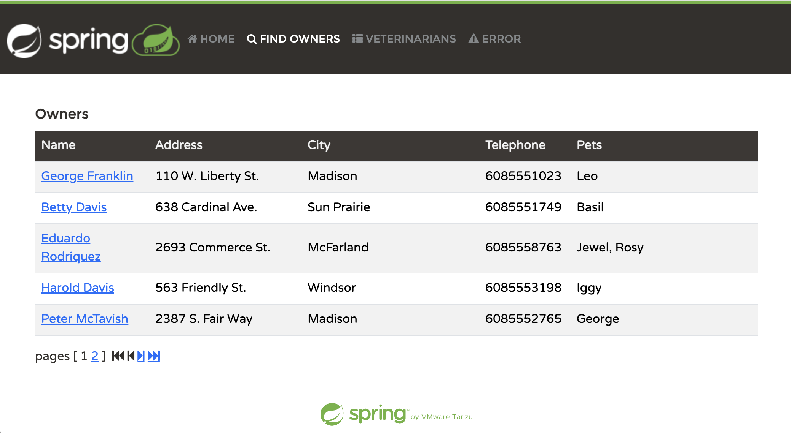
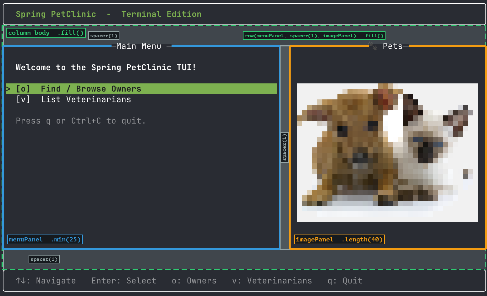
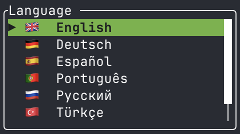
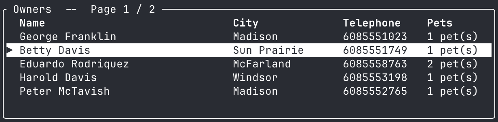
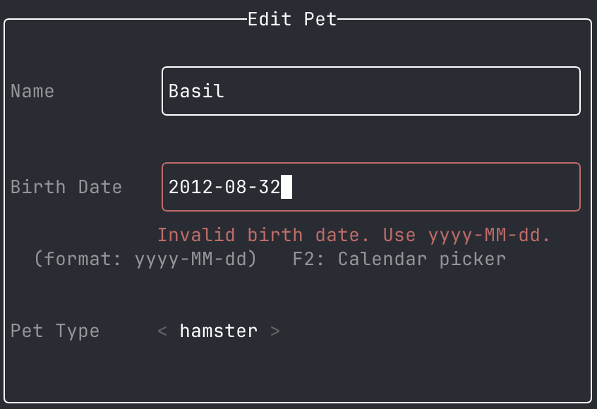
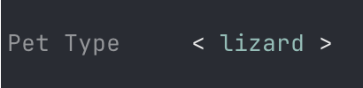
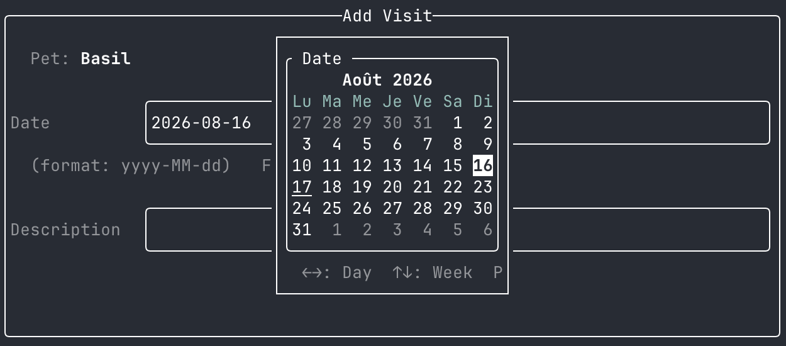

Dans [un précédent article publié au mois de mai](/2026/05/tamboui-java-in-the-terminal/),
je revenais sur ma découverte, lors de la conférence Devoxx France 2026, de **[TamboUI](https://tamboui.dev/)** :
un framework Java moderne permettant de construire des interfaces dans le terminal (dénommée **TUI**).
J'y présentais sa genèse, son architecture en 3 couches, certains widgets ainsi que
quelques petites démos autonomes s'exécutant avec **[JBang](https://www.jbang.dev/)**.


Une question m'avait alors traversé l'esprit : **comment TamboUI s'intègre-t-il dans des applications
d'entreprise, elles-mêmes construites généralement sur des frameworks comme Spring Boot ou Quarkus ?**
Les lecteurs réguliers de mon blog savent que j'aime répondre à ce genre de question en mettant les mains dans le code.
Membre de la [communauté Spring Petclinic](https://github.com/spring-petclinic), je profite de cette application de référence 
de l'écosystème Spring pour explorer et expérimenter de nouvelles approches technologiques 
comme ce fut le cas récemment avec [Spring Modulith](/2026/04/decouverte-de-spring-modulith/) 
et [jOOQ](/2025/06/de-spring-data-jpa-a-jooq/).


Pour monter en compétences, mais surtout pour le fun, je me suis attelé au **portage de Spring Petclinic du web vers le terminal**.
Mon objectif était clair : conserver si possible intact le backend et remplacer entièrement la couche web
par une interface TUI pilotée au clavier, ceci en essayant d'exploiter au maximum les capacités de TamboUI.
Cette migration a donné naissance à un nouveau fork : **[spring-petclinic-terminal](https://github.com/spring-petclinic/spring-petclinic-terminal)**.



Plutôt qu'un guide de migration pas-à-pas, j'ai choisi de vous proposer une **visite
guidée des fonctionnalités de TamboUI vues à travers Spring PetClinic**.

## Stratégie de migration

À travers ses nombreuses variantes, Spring PetClinic peut être perçu comme le terrain de jeu de l'écosystème Spring.
Il existe déjà [plus d'une vingtaine de forks](https://spring-petclinic.github.io/docs/forks.html) : REST, Kotlin, GraphQL, 
Spring Framework (sans Spring Boot), Microservices avec Spring Cloud, Angular, React, Flutter, Vaadin, Spring Data JPA ...
Chaque fork illustre la mise en œuvre d'une technologie différente sur **un domaine métier connu** :
des propriétaires (`Owner`), leurs animaux de compagnie (`Pet`) et des consultations (`Visit`) réalisées par
des vétérinaires (`Vet`).

C'est précisément ce qui en fait un excellent candidat pour tester TamboUI : étant donné que le modèle métier
et ses règles de gestion sont connues, on peut **se concentrer sur la couche de présentation** et évaluer le framework
sur le seul terrain qui compte ici : l'UI dans le terminal.

La [version canonique de Spring Petclinic](https://github.com/spring-projects/spring-petclinic) est une application
web relativement classique, construite avec **Spring Boot**, **Spring MVC**, **Thymeleaf** et **Bootstrap** dont
voici la capture d'écran de l'**écran Owners** :


La stratégie du fork **[spring-petclinic-terminal](https://github.com/spring-petclinic/spring-petclinic-terminal)** est double :

1. **Conserver si possible intact tout le backend** : entités JPA, repositories Spring Data, schémas
   H2/MySQL/PostgreSQL, cache Caffeine. Les couches service et persistance ne bougent pas, ou peu.
2. **Remplacer entièrement la couche web** (Spring MVC + Thymeleaf + Bootstrap) par des écrans TUI
   construits avec TamboUI.

La différence est matérialisée par le commit [`2152497`](https://github.com/spring-petclinic/spring-petclinic-terminal/commit/2152497d544dac8c30a5ee26127002698173f8e8) dont voici les stats :

```
129 files changed, 6433 insertions(+), 22945 deletions(-)
```

Ne vous y trompez pas : 80% des suppressions viennent du `petclinic.css` généré et de 2 polices non réutilisées
de l'interface web.

## Architecture de Spring PetClinic Terminal

TamboUI est encore jeune. Son écosystème l'est encore davantage.
À ma connaissance, il n'existe pas encore de starter Spring Boot officiel.
Lors de mes recherches, j'avais bien trouvé le projet OSS [tamboui-spring](https://github.com/KyleKreuter/tamboui-spring).
Mais, sans référence ni release, je n'ai pas souhaité l'utiliser, préférant une intégration à la main, sans glue intermédiaire
sur laquelle je n'aurais pas eu la main.

Dans Spring Petclinic Terminal, tout ce code de la couche présentation (TUI) est centralisé dans le
**package java `org.springframework.samples.petclinic.terminal`**.

Première surprise quand on lance l'appli : **aucun port n'est ouvert**, aucun Tomcat ni Jetty n'est nécessaire.
Tout comme une application batch, une application TUI démarre avec un simple main et ne nécessite pas de serveur web.
Dans le fichier de configuration `application.properties`, on force donc le type d'application à `NONE` :

```properties
# Terminal application — no embedded web server
spring.main.web-application-type=none
```

La classe main [`PetClinicApplication`](https://github.com/spring-petclinic/spring-petclinic-terminal/blob/v0.4.0/src/main/java/org/springframework/samples/petclinic/PetClinicApplication.java) reste inchangée.
Tout le code TamboUI est intégré à l'application existante en tant que beans Spring.
Le point d'entrée de la couche présentation TUI a été placée dans le bean [`PetClinicTuiRunner`](https://github.com/spring-petclinic/spring-petclinic-terminal/blob/v0.4.0/src/main/java/org/springframework/samples/petclinic/terminal/PetClinicTuiRunner.java) qui implémente l'interface
`ApplicationRunner` et délégue le démarrage de la boucle TUI à la classe principale [`PetClinicTui`](https://github.com/spring-petclinic/spring-petclinic-terminal/blob/v0.4.0/src/main/java/org/springframework/samples/petclinic/terminal/core/PetClinicTui.java) chargée 
d'orchestrer les écrans et la navigation entre eux :
```java

@Component
public class PetClinicTuiRunner implements ApplicationRunner {

    private final PetClinicTui tui;

    public PetClinicTuiRunner(PetClinicTui tui) {
        this.tui = tui;
    }

    @Override
    public void run(@NonNull ApplicationArguments args) {
        tui.run();
    }
}
```

Le tableau ci-dessous résume les principaux changements d'architecture entre la version web
et la version terminal de Spring PetClinic :

| Aspect              | Avant (web)                       | Après (terminal)                                    |
|---------------------|-----------------------------------|-----------------------------------------------------|
| Type d'application  | `WebApplicationType.SERVLET`      | `WebApplicationType.NONE`                           |
| Port réseau         | 8080                              | **aucun**                                           |
| Point d'entrée      | `@SpringBootApplication` + Tomcat | `@SpringBootApplication` + **`PetClinicTuiRunner`** |
| Rendu UI            | Thymeleaf (HTML) + Bootstrap      | TamboUI Toolkit DSL (TUI)                           |
| Couche présentation | **6** `@Controller` Spring MVC    | 10 écrans typés `@Component`                        |
| Logique applicative | Mélangée aux contrôleurs          | 4 `@Service` dédiés                                 |
| Couche de données   | JPA / Hibernate                   | **inchangée**                                       |

## Modélisation d'un écran TUI

Dans [mon article précédent](/2026/05/tamboui-java-in-the-terminal/), je décrivais les **trois niveaux d'API** proposées par TamboUI :
1. `Backend` bas niveau
2. `TuiRunner` intermédiaire
3. `Toolkit` déclaratif

PetClinic s'appuie sur le niveau le plus **haut** de TamboUI : le **Toolkit DSL**.
Pour le setup, quelques appels d'API de niveau intermédiaire sont nécessaires pour configurer le backend, la gestion d'erreurs et le moteur CSS.

L'intégration repose sur les trois principes détaillés ci-dessous.

### Un bean Spring par écran

Tous les écrans implémentent la même interface [`PetClinicScreen`](https://github.com/spring-petclinic/spring-petclinic-terminal/blob/v0.4.0/src/main/java/org/springframework/samples/petclinic/terminal/core/PetClinicScreen.java) et **se déclarent eux-mêmes responsables** d'un
d'écran identifié par l'énumération [`ScreenId`](https://github.com/spring-petclinic/spring-petclinic-terminal/blob/v0.4.0/src/main/java/org/springframework/samples/petclinic/terminal/core/ScreenId.java). Cette interface permet d'implémenter le pattern **service locator** :

```java
public interface PetClinicScreen {
    
    ScreenId screenId();    // Nom de l'écran (enum ScreenId) que le bean gère

    default void onEnter() { // Callback appelé à chaque entrée sur l'écran 
    }
    
    Element render();  // Arbre de composants TamboUI à afficher

    // ...
}
```

Le framework Spring injecte une `List` de `PetClinicScreen` dans le constructeur de `PetClinicTui`
qui crée la table de routage typée `Map<ScreenId, PetClinicScreen>` :

```java

@Component
public class PetClinicTui {

    private final AppState state;

    private final Map<ScreenId, PetClinicScreen> screens;

    public PetClinicTui(AppState state, List<PetClinicScreen> screens) {
      this.state = state;
      this.screens = screens.stream().collect(Collectors.toMap(PetClinicScreen::screenId, Function.identity()));
    }
}
```

Ajouter un nouvel écran consiste donc à créer une classe `@Component` qui implémente `PetClinicScreen`.
Au démarrage de l'application, Spring scanne ce bean et l'injecte dans la liste sans qu'on ait à modifier la classe principale.

### Un état global partagé et un état par écran

Contrairement à une application web accessible par plusieurs utilisateurs, une application
TUI est mono-utilisateur. Elle peut donc conserver un **état global** dans un bean singleton.
Lors de l'utilisation de l'application, un seul écran est actif. 
C'est précisément le rôle de la classe [`AppState`](https://github.com/spring-petclinic/spring-petclinic-terminal/blob/v0.4.0/src/main/java/org/springframework/samples/petclinic/terminal/core/AppState.java) : elle porte le contexte global de l'application 
(écran courant, owner/pet sélectionné, mode lecture/édition).
La navigation se fait par **mutation d'état** :

```java
public void navigateTo(ScreenId nextScreen) {
  this.currentScreen = nextScreen; // la prochaine frame résoudra et rendra ce nouvel écran
}
```

En complément de cet état global partagé par tous les écrans, chaque écran possède son propre bean d'état local
(ex: [`OwnerSearchState`](https://github.com/spring-petclinic/spring-petclinic-terminal/blob/v0.4.0/src/main/java/org/springframework/samples/petclinic/terminal/owners/OwnerSearchState.java) pour l'écran [`OwnerSearchScreen`](https://github.com/spring-petclinic/spring-petclinic-terminal/blob/v0.4.0/src/main/java/org/springframework/samples/petclinic/terminal/owners/OwnerSearchScreen.java)).

### Un rendu déclaratif

Le DSL `Toolkit` fournit des méthodes factory (`panel`, `column`, `row`, `text`,
`textInput`, `spacer`...) ainsi qu'une API fluide pour le style (`.bold()`, `.rounded()`, `.fill()` ...).
Chaque écran implémente la méthode `render()` qui renvoie un arbre d'`Element` représentant l'interface utilisateur.
Extrait de la classe `OwnerSearchScreen` :
```java
@Override
public Element render() {
  Element body = column(spacer(1),
          panel(column(spacer(1), text("  " + messages.get("tui.owner.searchPrompt")).bold(), spacer(1),
                  textInput(searchState.searchInput()).rounded()
                          .focusedBorderColor(FormFields.FOCUSED_BORDER)
                          .id("owner-search-input")
                          .onSubmit(this::executeSearch)
                          .onKeyEvent(this::handleKey),
                  spacer(1), text("  " + messages.get("tui.owner.searchHint")).addClass("hint"), spacer(1)))
                  .title(messages.get("findOwners"))
                  .titleCenter()
                  .rounded()
                  .fill(),
          spacer(1))
          .fill();

  return chrome(messages.get("tui.appTitle"), body,
          "  Enter: Search   Ctrl+N: " + messages.get("addOwner") + "   Esc: Back   q: Quit  ");
}
```
La méthode utilitaire `chrome()` templatise le rendu de l'écran : 
1. En-tête avec le titre de l'application
2. Corps de l'écran (ici le formulaire de recherche)
3. Barre de raccourcis en pied de page

## Tour des fonctionnalités de TamboUI

À présent que l'on a posé les bases de l'architecture, je vous propose un **tour des fonctionnalités de TamboUI**
mises en œuvre dans PetClinic.

### Layout par contraintes

Entraperçu dans le paragraphe précédent, le système de layout de TamboUI repose sur un **système de contraintes** hérité de
[Ratatui](https://ratatui.rs/). On compose des `column` et des `row`, et chaque enfant déclare comment il occupe
l'espace :
- `.length(n)` pour une taille fixe
- `.fill()` pour occuper le reste de l'espace
- `.min(n)` pour une taille minimale
- `.percentage(n)` pour un pourcentage de l'espace disponible

À titre d'exemple, l'écran d'accueil découpe ainsi l'espace en un menu à largeur minimale et un panneau image à
largeur fixe :

```java
	Element menuPanel = panel(column(spacer(1), text("  " + messages.get("tui.welcome.message")).bold(), spacer(1),
        list(messages.get("tui.menu.owners"), messages.get("tui.menu.vets")).selected(currentSel)
                .id("main-menu")
                .focusable()
                .onKeyEvent(e -> handleKey(e, size, currentSel)),
        spacer(1), text("  " + messages.get("tui.hint.pressQuit")).addClass("hint"), spacer(1)))
        .title(messages.get("tui.mainMenu"))
        .titleCenter()
        .rounded()
        .min(25)
        .fill();

Panel imagePanel = panel(
        column(spacer(),
                row(spacer(), widget(petsImage).length(petsImageDisplayWidth), spacer())
                        .length(petsImageDisplayHeight),
                spacer())
                .fill())
        .title("🐾 " + messages.get("pets"))
        .titleCenter()
        .rounded()
        .length(40);

Element body = column(spacer(1), row(menuPanel, spacer(1), imagePanel).fill(), spacer(1)).fill();
```

Pas de calcul de pixels ni de média queries : on décrit l'intention et le **résolveur de
contraintes** se débrouille, y compris lors du redimensionnement de la fenêtre.


### Des images dans le terminal


Le module `tamboui-image` assure le rendu des images via les protocoles graphiques du terminal ou, à défaut, 
via des [blocs d'éléments Unicode](https://en.wikipedia.org/wiki/Block_Elements).
Lorsque le terminal le permet (ex: sous iTerm2), l'écran d'accueil affiche la belle image `pets.png`, 
symbole de Spring Petclinic. Nous ne sommes plus dans le terminal ASCII des années 80.
L'affichage d'images est une fonctionnalité qu'on retrouve dans les agents de codage CLI qui génèrent 
puis affichent screenshots et diagrammes.

La classe [`PetsImageLoader`](https://github.com/spring-petclinic/spring-petclinic-terminal/blob/v0.4.0/src/main/java/org/springframework/samples/petclinic/terminal/welcome/PetsImageLoader.java) s'appuie sur le widget `Image` de TamboUI pour charger l'image. 
Petite subtilité : lorsque `spring-petclinic-terminal` est compilé en mode GraalVM natif, 
le chargement du fichier PNG échoue car il dépend du package `java.awt.image.BufferedImage` semble-t-il non supporté.
Petclinic bascule alors sur le chargement d'une image au format raw ARGB.

et calculer la largeur et la hauteur d'affichage en fonction de la taille du terminal :


```java
try (InputStream is = PetsImageLoader.class.getResourceAsStream("/images/pets.png")) {
    if (is == null) {
      throw new IllegalStateException("PNG resource not found");
    }
    BufferedImage bufferedImage = ImageIO.read(is);
    return Image.of(ImageData.fromBufferedImage(bufferedImage));
} catch (IOException e) {
    throw new IllegalStateException("Failed to load pets image from " + PNG_RESOURCE, e);
}
```
L'utilisation de la classe `Image` stockée dans la variable `petsImage` est faite lors 
de la construction de l'`imagePanel` présenté dans le paragraphe précédent.

### Listes de sélection scrollable


L'application Petclinic est internationalisée et traduite en 8 langues. L'anglais est la langue par défaut.
L'utilisateur peut changer de langue à tout moment via le raccourci `Ctrl+L`.
Une liste de sélection apparait alors, avec la langue courante mise en évidence.
La sélection se fait au clavier (flèches haut/bas + Entrée).

La classe [`LanguageSelectScreen`](https://github.com/spring-petclinic/spring-petclinic-terminal/blob/v0.4.0/src/main/java/org/springframework/samples/petclinic/terminal/i18n/LanguageSelectScreen.java) implémente l'écran de sélection de langue.
Elle s'appuie sur le **widget `list`** de TamboUI. Ce dernier est configuré
pour que la sélection soit mise en évidence et que la barre de scrolling n'apparaisse uniquement 
que si le nombre d'éléments (de langues) dépasse la hauteur de l'écran.

```java
List<String> items = Arrays.stream(LOCALES).map(SupportedLocale::displayLabel).toList();
ListElement<?> menu = list(items)
        .selected(selectedIndex)
        .title(messages.get("tui.language.title"))
        .rounded()
        .fill()
        .id("language-list")
        .focusable()
        .highlightSymbol("▶ ")
        .autoScroll()
        .scrollbar(ScrollBarPolicy.AS_NEEDED);
```

### Tableaux paginés

La recherche d'un propriétaire se fait par nom ou prénom. 
Son résultat est restitué dans un **tableau** rendu par le **widget `table`**.


La classe [`OwnerListScreen`](https://github.com/spring-petclinic/spring-petclinic-terminal/blob/v0.4.0/src/main/java/org/springframework/samples/petclinic/terminal/owners/OwnerListScreen.java) implémente l'écran de liste des propriétaires.
Voici un extrait de sa méthode de rendu :
```java
List<Owner> owners = searchState.ownerSearchResults();
TableState tableState = ownerListState.tableState();

List<Row> rows = owners.stream()
        .map(o -> Row.from(o.getFirstName() + " " + o.getLastName(), o.getCity(), o.getTelephone(),
                messages.format("tui.format.petsCount", o.getPets().size())))
        .toList();

List<Row> displayRows = rows.isEmpty() ? List.of(Row.from(messages.get("tui.no.owners"))) : rows;

TableElement ownerTable = table()
    .header(messages.get("name"), messages.get("city"), messages.get("telephone"), messages.get("pets"))
    .widths(Constraint.fill(), Constraint.length(16), Constraint.length(12), Constraint.length(10))
    .rows(displayRows)
    .state(tableState)
    .highlightSymbol("▶ ")
    .title(" " + messages.get("owners") + "  --  Page " + ownerListState.currentPage() + " / "
            + ownerListState.totalPages() + " ")
    .rounded()
    .fill()
    .id("owner-list")
    .focusable();
```

La pagination reste assurée par Spring Data JPA.
La méthode `executeSearch()` de la classe `OwnerSearchScreen` interroge le repository [`OwnerRepository`](https://github.com/spring-petclinic/spring-petclinic-terminal/blob/v0.4.0/src/main/java/org/springframework/samples/petclinic/owner/OwnerRepository.java) 
pour récupérer une instance de `Page<Owner>` et la stocker dans l'état `OwnerSearchState`.
Les méthodes `previousPage()` et `nextPage()` de la classe `OwnerListScreen` permettent 
quant à elles de naviguer entre les pages de résultats.

### Formulaires et validation

Dans la version web de Petclinic, la validation des formulaires repose sur le couple `@Valid` / `BindingResult` de Spring MVC.

TamboUI ne permet pas de réutiliser Bean Validation. Néanmoins, depuis la version 0.3, il propose
un **système de validation natif** qui s'appuie sur les classes `Validator` et `FormFieldElement`.
TamboUI **exécute les validateurs à chaque frappe**. 
En cas d'invalidité, comme le montre le formulaire d'édition d'un animal ci-dessous,
TamboUI affiche le **message erreur** sous le champ invalide et le **met en évidence**.


La validation d'un formulaire a été mise en œuvre sur 3 écrans.
La classe [`FormFields`](https://github.com/spring-petclinic/spring-petclinic-terminal/blob/v0.4.0/src/main/java/org/springframework/samples/petclinic/terminal/shared/FormFields.java) centralise les méthodes utilitaires permettant de construire les champs de formulaire
et d'avoir une validation homogène sur l'ensemble des écrans.
La méthode `validated()` ci-dessous instancie un champ de formulaire avec validation et style cohérent :

```java
public static FormFieldElement validated(String label, FormState form, String name, 
        Validator[] validators, Runnable onSubmit, KeyEventHandler onKey) {
  return formField(label, form.textField(name)).formState(form, name)
          .validate(validators)
          .showInlineErrors(true)               // erreur affichée sous le champ
          .rounded()
          .focusedBorderColor(Color.GREEN)      // vert PetClinic quand focus
          .errorBorderColor(Color.RED)          // rouge quand invalide
          .onSubmit(onSubmit)
          .onKeyEvent(onKey);
}
```

Les validateurs sont composables. On peut ainsi combiner des `Validators` intégrés (champ requis, longueur
max, regex) avec des validateurs maisons.
La classe `Validators` centralise les validateurs proposés par TamboUI. 
Lorsque les validateurs intégrés ne suffisent pas, on peut créer ses propres validateurs.
Exemple d'un validateur de date ISO réutilisable :

```java
public static Validator date(String message) {
    return value -> {
        if (value == null || value.isBlank())
            return ValidationResult.valid();
        try {
            LocalDate.parse(value.trim());
            return ValidationResult.valid();
        } catch (DateTimeParseException ex) {
            return ValidationResult.invalid(message);
        }
    };
}
```
Exemple de combinaison des validateurs `required` et `date` pour le champ `birthDate` du formulaire d'édition d'un animal :
```java
public Validator[] validatorsFor(String field) {
  return switch (field) {
    // ...
    case BIRTH_DATE -> new Validator[] { Validators.required(messages.get("error.birthDate.format")),
            FormFields.date(messages.get("error.birthDate.format")) };
    default -> throw new IllegalArgumentException("Unknown pet form field: " + field);
  };
}
```

### Liste déroulante


L'utilisateur sélectionne le type d'animal (chien, chat, lézard ...) au travers d'une liste déroulante
horizontale (`FieldType.SELECT`) dont l'état est stocké dans une instance de `SelectFieldState`.

A l'initialisation, l'index est sélectionné via la méthode `selectIndex()`.
Lors de la sauvegarde, la méthode `selectedIndex()` permet de récupérer l'index du type d'animal sélectionné par l'utilisateur.

```java
List<String> typeNames = this.petTypes.isEmpty() ? List.of(messages.get("tui.loading"))
: this.petTypes.stream().map(PetType::getName).toList();
this.petTypeSelect = new SelectFieldState(typeNames, 0);
```

### Un sélecteur de date

Que ce soit pour saisir une date de naissance ou une date de visite, Spring Petclinic permet de saisir
la date au clavier ou via un **vrai calendrier** accessible par la touche `F2` et permettant une 
navigation jour / semaine / mois.


La boite de dialogue du calendrier [`DatePickerScreen`](https://github.com/spring-petclinic/spring-petclinic-terminal/blob/v0.4.0/src/main/java/org/springframework/samples/petclinic/terminal/datepicker/DatePickerScreen.java) s'appuie sur le **widget `calendar`** hautement configurable :

```java
CalendarEventStore store = CalendarEventStore.empty().add(selected, Style.EMPTY.bold().reversed());
if (!today.equals(selected)) {
    store = store.add(today, Style.EMPTY.underlined());
}
        
Element calendarEl = calendar(selected).dateStyler(store)
  .showMonthHeader()
  .showWeekdaysHeader(Style.EMPTY.fg(Color.CYAN))
  .showSurrounding(Style.EMPTY.dim())
  .firstDayOfWeek(DayOfWeek.MONDAY)
  .title(datePickerState.title())
  .rounded()
  .focusable()
  .id("date-picker-calendar")
  .onKeyEvent(this::handleKey);
```

Le jour sélectionné et le jour courant sont mis en évidence simultanément grâce à un `CalendarEventStore`.
La date choisie est renvoyée au formulaire appelant via l'état [`DatePickerState`](https://github.com/spring-petclinic/spring-petclinic-terminal/blob/v0.4.0/src/main/java/org/springframework/samples/petclinic/terminal/datepicker/DatePickerState.java).

### Styling par CSS

TamboUI permet de **séparer le style du code** grâce à des feuilles de style `.tcss` dont la syntaxe propriétaire 
se rapproche du CSS.
PetClinic charge le thème `petclinic.tcss` dont voici un extrait :

```css
$accent:       #6db33f;
$danger:       red;

Panel {
  border-type: rounded;
}

#app-title {
  color: $accent;
  text-style: bold;
}

.hint {
  text-style: dim;
}
```

Comme en HTML, les composants référencent des **id** (ex: `.id("app-title")`) et des **classes**
(ex: `.addClass("hint")`).

Configuré dans la boucle de rendu de la classe `PetClinicTui`, le `StyleEngine` applique le thème au moment du rendu.
Ainsi, le thème pourrait être changé sur demande de l'utilisateur si besoin est, par exemple, pour gérer un dark ou light mode.

```java
public void run() {
    try {
        StyleEngine engine = StyleEngine.create();
        engine.loadStylesheet("petclinic", "/themes/petclinic.tcss");
        engine.setActiveStylesheet("petclinic");
        // ...
        try (ToolkitRunner runner = ToolkitRunner.builder().config(config).styleEngine(engine).build()) {
          // ...
        }
    }
    catch (Exception ex) {
        throw new RuntimeException("TUI runner failed", ex);
    }
}
```

### Tester une TUI

Pour tester une IHM de type Terminal UI de bout en bout, TamboUI fournit un pilote *headless* 
qui simule des frappes et inspecte l'état des composants : **Pilot**.

Certains tests Spring utilisant MockMvc ont ainsi pu être reproduits dans le terminal avec Pilot.
C'est le cas de [`OwnerSearchScreenTest`](https://github.com/spring-petclinic/spring-petclinic-terminal/blob/v0.4.0/src/test/java/org/springframework/samples/petclinic/terminal/owners/OwnerSearchScreenTest.java) qui rejoue un **parcours complet** : recherche => liste => détail propriétaire 
=> ajout d'une visite. Le tout dans un `@SpringBootTest` classique, avec
la propriété `petclinic.tui.enabled=false` pour que la vraie boucle TUI ne démarre pas (le test Pilot dispose d'une boucle dédiée).

Extrait de la méthode `when_searching_by_partial_name_da_should_display_both_davis_owners()` :
```java
try (ToolkitTestRunner test = startTest()) {
    Pilot pilot = test.pilot();

  // L'utilisateur tape "Da", ce qui correspond avec Betty Davis et Harold Davis
  typeText(pilot, "Da");
  pilot.press(KeyCode.ENTER);   // puis Entrée
  pilot.pause();
  then(appState.currentScreen()).isEqualTo(ScreenId.OWNER_LIST);
  then(searchState.ownerSearchResults())
        .hasSize(2)
        .allMatch(o -> o.getLastName().startsWith("Da"));
  
  // Sélectionne le premier résultat (Betty Davis) avec Entrée
  pilot.press(KeyCode.ENTER);
  pilot.pause();
  then(appState.currentScreen()).isEqualTo(ScreenId.OWNER_DETAILS);
  // Vérifie l'état de l'application en checkant directement le contenu de la classe `OwnerDetailsState`
  then(ownerDetailsState.cachedOwner()).isNotNull();
  then(ownerDetailsState.cachedOwner().getLastName()).isEqualTo("Davis");
}  
```

Le traitement des évènements clavier lors d'un appel à `Pilot.press()` est dispatché
dans une file d'évènements traités en asynchrone par un autre thread.
Pour pallier un problème d'instabilité d'exécution du test Pilot depuis une Github Actions,
j'ai remplacé l'appel à la méthode `pilot.pause()` par les méthodes customs `awaitScreen()` et `awaitCondition()`
qui privilégient du polling régulier à un sleep de 50ms.

## Jouer avec l'application

Si vous voulez tester l'application, rien de plus simple.
Commencez par cloner le repo :
```bash
git clone https://github.com/spring-petclinic/spring-petclinic-terminal.git
cd spring-petclinic-terminal
```

Puis, au choix, passez par Maven ou Gradle pour l'exécuter :
```bash
# Maven
./mvnw spring-boot:run

# ou Gradle
./gradlew bootRun
```

De même que sa version originale, l'application `spring-petclinic-terminal` supporte la compilation native avec GraalVM.
Voici comment construire le binaire natif puis l'exécuter sans JVM :
```bash
./mvnw -Pnative native:compile
target/spring-petclinic-terminal
```
En prérequis, la compilation native demande l'installation de [GraalVM](https://www.graalvm.org/).

## Bilan

Ce portage de Spring Petclinic de la version Spring MVC vers une version TUI démontre que TamboUI 
offre les fonctionnalités nécessaires pour développer des applications de gestion. Petclinic sera 
vraisemblablement la seule application de gestion développée avec TamboUI. Car en pratique,
cela présente peu d'intérêt.
Fun, assisté par Github Copilot, cet exercice m'aura permis de replonger dans les années 80, 
ère pré-Windows où toutes les applications de gestion étaient développées en mode texte.

Finalisé, ce portage répond à la question initiale : **oui, TamboUI tient la route sur une
vraie application.** Au-delà des démos, le framework offre tout ce qu'attend une application de
saisie sérieuse :
- des **formulaires avec validation** et retours visuels par champ,
- des **widgets riches** (listes, tableaux, calendrier, images, champs select, saisie de texte),
- une **navigation clavier** fluide et intuitive,
- un **styling séparé du code** via TCSS,
- un **outillage de test** (Pilot) qui rejoue de vrais parcours,
- et une intégration avec d'autres frameworks comme Spring.

L'intégration avec Spring Boot s'est faite sans effort ni problème particulier. 
TamboUI est encore jeune (version `0.4.0`) et ses APIs évoluent encore, mais le portage de PetClinic
montre déjà un framework étonnamment complet et agréable à utiliser. La « tambouille » a pris.


## Références

* 📦 **Code source** : [github.com/spring-petclinic/spring-petclinic-terminal](https://github.com/spring-petclinic/spring-petclinic-terminal)
* 🔗 **Article précédent** : [TamboUI, Java in the terminal](https://javaetmoi.com/2026/05/tamboui-java-in-the-terminal/)
* 📚 **Documentation TamboUI** : [tamboui.dev](https://tamboui.dev/)


