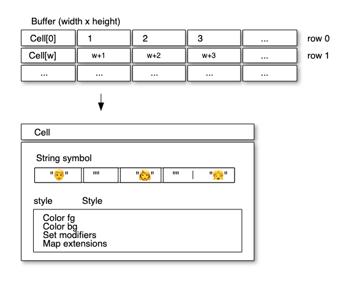
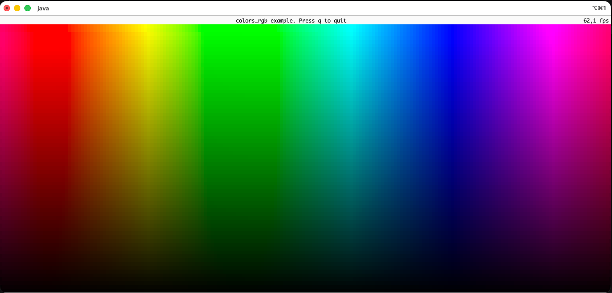
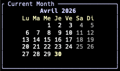
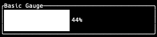
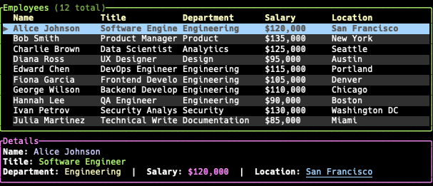

Conférence : [Devoxx France 2026](https://www.devoxx.fr/)<br>
Date : 22 avril 2026<br>
Speakers : Cédric Champeau (Oracle) et Max Rydahl Andersen (IBM / Red Hat)<br>
Format : Conférence (45mn)<br>
Site : [tamboui.dev](https://tamboui.dev/)<br>
Slides : https://tamboui.github.io/devoxx-france-2026/

Lors de la conférence **Devoxx France 2026**, j'ai assisté à un talk venu tout droit d'une comète :
la présentation de **[TamboUI](https://tamboui.dev/)** (prononcer "**tambouille**", façon française),
un tout nouveau framework Java dédié aux **interfaces utilisateur dans le terminal** (ou *Terminal User Interface* TUI
en anglais, plus anciennement connus sous le nom de *Text-based User Interface*).
Derrière ce nom amusant, deux pointures de l'écosystème Java : **Cédric Champeau** (longtemps lead de **Gradle**,
aujourd'hui dans les équipes **Micronaut** et **GraalVM** chez Oracle) et **Max Rydahl Andersen**
(créateur de **JBang**, co-dirige le projet **Quarkus** chez Red Hat). Autant dire que la généalogie du projet est
sérieuse.
Cet article revient sur les **motivations**, l'**architecture** et les **APIs** de TamboUI.


## Pourquoi un nouveau framework TUI en 2026 ?

En 2026, les outils agentiques ont remis le **terminal** sur le devant de la scène.
Qui se souvient du gestionnaire de fichiers [Norton Commander](https://fr.wikipedia.org/wiki/Norton_Commander) tournant
sur MS DOS ?
L'application star de 2025, j'ai nommé **Claude Code**, s'appuie sur la lib JavaScript
**[React Ink](https://github.com/vadimdemedes/ink)**. De même pour **Codex CLI**. Plus largement, les TUI prolifèrent : 
**[Ratatui](https://ratatui.rs/)** en Rust, **[Bubble Tea](https://github.com/charmbracelet/bubbletea/)** et
**[Charm](https://charm.land/)** en Go, **[Rich](https://github.com/textualize/rich)** et
**[Textual](https://textual.textualize.io/)** en Python ... Bref, **tout le monde avait son framework TUI moderne, sauf Java**.
Le langage Java fait tourner les plus grands systèmes financiers et les applications Android, mais paradoxallement, avant TamboUI,
il n'existait aucun framework permettant de faciliter le développement d'applications dans le terminal.

Pas tout à fait, puisque Java disposait jusqu'ici de :

- **[JLine 3](https://github.com/jline/jline3)** pour la gestion bas niveau du terminal,
- **[picocli](https://github.com/remkop/picocli)** pour les CLI déclaratives,
- et **[Lanterna](https://github.com/mabe02/lanterna)**, vieillissant, pour faire du Swing dans un terminal.

Mais **rien d'équivalent à Ratatui ou React Ink**. C'est précisément ce manque qui a déclenché la création de TamboUI.
L'histoire est amusante : Cédric s'interrogeait sur **[Bluesky](https://bsky.app/profile/melix.champeau.me/post/3m7ulazaogt25)**
sur les frameworks TUI utilisés par Claude
Code. Max lui répond "*probablement Ratatui*". Conclusion : ils utilisent **Claude Code** pour porter Ratatui en Java,
puis s'émancipent rapidement du portage initial pour concevoir **un framework pensé pour les développeurs Java**,
multi-couches et compatible **GraalVM Native Image**. Première release publique annoncée le **17 février 2026** annoncé
dans l'article conjoint de ([Cédric](https://melix.github.io/blog/2026/02/17-announcing-tamboui.html)
et [Max](https://xam.dk/blog/announcing-tamboui/)).

Au passage, les vieilles excuses sont balayées :

| Excuse usuelle                                        | Réponse des speakers                                                                                            |
|-------------------------------------------------------|-----------------------------------------------------------------------------------------------------------------|
| "Java démarre trop lentement"                         | Non, d'autant plus avec les **images natives GraalVM** : démarrage instantané                                   |
| "Compliqué à installer et lancer"                     | Non, une seule ligne de commande **JBang** suffit                                                               |
| "Distribuer son application Java relève du cauchemar" | Non, plus avec **JReleaser** : pour des releases multi-format, en une seule commande et de n'importe quel device |
| "Java est trop verbeux"                               | Mettez-vous au **Java moderne** : records, types scellés, pattern matching, switch expressions                  |

## Premier contact en 30 secondes

Si **[JBang](https://www.jbang.dev/)** est installé sur votre poste, lancer la suite des **démos de TamboUI** tient en une commande :

```shell
jbang demos@tamboui
```

Au menu : **filtres** de recherche, **tableaux** scrollables, **calendriers**, **canvas**, gestion des **emojis**
et même rendu d'**images** et de **vidéos** dans le terminal. Le tout sans builder le projet.

Pour un *Hello, World*, on peut écrire un seul fichier `HelloWorld.java` et le lancer avec `jbang HelloWorld.java` :

```java
//DEPS dev.tamboui:tamboui-tui:LATEST
//DEPS dev.tamboui:tamboui-jline3-backend:LATEST

import dev.tamboui.tui.TuiRunner;
import dev.tamboui.tui.event.KeyEvent;
import dev.tamboui.widgets.paragraph.Paragraph;
import dev.tamboui.text.Text;

public class HelloWorld {
    public static void main(String[] args) throws Exception {
        try (var tui = TuiRunner.create()) {
            tui.run(
                    (event, runner) -> switch (event) {
                        case KeyEvent k when k.isQuit() -> {
                            runner.quit();
                            yield false;
                        }
                        default -> false;
                    },
                    frame -> frame.renderWidget(
                            Paragraph.builder()
                                    .text(Text.from("Hello, TamboUI! Press 'q' to quit."))
                                    .build(),
                            frame.area())
            );
        }
    }
}
```

Quelques détails à apprécier :

* **try-with-resources** pour libérer proprement le terminal,
* **switch pattern matching** sur les événements
* et **zéro plomberie** pour gérer la boucle d'événements ou le redimensionnement.

## Une architecture en trois couches

Une des forces de TamboUI est de proposer **trois niveaux d'abstraction**, qu'on choisit en fonction de son besoin :

- **High** :  basé sur  **Toolkit DSL**, déclaratif, API builder, utilisation possible de widgets
- **Mid** : classe `TuiRunner` gérant la boucle d'évènements et le rendu du terminal
- **Low** : API bas niveau nommée **Immediate Mode**, pour les puristes

### 1. Low level : `Backend` + Immediate Mode

L'interface **[`Backend`](https://github.com/tamboui/tamboui/blob/v0.2.0/tamboui-core/src/main/java/dev/tamboui/terminal/Backend.java)**
constitue la couche la plus basse de l'architecture de TamboUI : c'est elle qui dialogue directement avec le terminal.
Elle prend en charge toutes les opérations de bas niveau : positionnement du curseur, insertion de lignes, défilement,
gestion des caractères d'échappement, détection des redimensionnements et lecture des saisies utilisateur.

TamboUI propose **trois implémentations interchangeables** selon le contexte d'exécution :

| Backend                      | Spécialité                                                                                                                                | Version de Java |
|------------------------------|-------------------------------------------------------------------------------------------------------------------------------------------|-----------------|
| **`tamboui-jline3-backend`** | Le choix **par défaut**, basé sur la Java Console Librairie [**JLine 3**](https://github.com/jline/jline3)                                | 8+              |
| **`tamboui-aesh-backend`**   | Terminal distant accessible par **SSH** ou le **Web** (via la librairie Another Extendable SHell [Aesh](https://github.com/aeshell/aesh)) | 8+              |
| **`tamboui-panama-backend`** | Accès natif via le [**project Panama / FFM**](https://www.roray.dev/blog/java-io-uring-ffm/)                                              | 22+             |

Ce découpage en backends distincts permet à TamboUI de fonctionner aussi bien dans un terminal local classique
que dans un contexte distant (SSH, web) ou encore de tirer parti des API natives modernes de la JVM.
TamboUI peut être intégré aussi bien sur des applications Java 8 que Java 26.

Au coeur du rendu, on retrouve un modèle inspiré de Ratatui : `Buffer` → `Cell` → `Style`.

À chaque frame, les widgets réécrivent entièrement en mémoire un **`Buffer`** 2D de cellules,
sans conserver aucun souvenir de l'état précédent.
C'est le principe de l'**Immediate Mode**, paradigme utilisé par exemple en 1997 dans le jeu Quake 2 tournant sous
OpenGL.
TamboUI ajoute ensuite une couche de **Retained Mode** par-dessus :
il calcule un **diff entre le buffer courant et la frame précédente**
pour ne transmettre au terminal que les cellules qui ont réellement changé, limitant ainsi les I/O.
Ces deux paradigmes coexistent donc : l'Immediate Mode gouverne la façon dont les widgets écrivent dans le buffer,
tandis que le Retained Mode gouverne la façon dont ce buffer est transmis au terminal.

S'en suit l'exécution de la **colors-rgb-demo** avec jbang :

Le framerate est de 62 fps sur mon laptop.
Naturellement, plus la fenêtre du terminal est grande, plus le framerate descend.
Ce n'est pas Java qui fait baisser la fréquence de rafraîchissement, mais les IO du terminal.

La classe [`ColorsRgbDemo`](https://github.com/tamboui/tamboui/blob/v0.2.0/tamboui-widgets/demos/colors-rgb-demo/src/main/java/dev/tamboui/demo/ColorsRgbDemo.java)
montre un exemple de code bas niveau initialisant manuellement un terminal en mode raw (plein écran et curseur caché)
puis tourne dans une boucle qui redessine l'interface utilisateur à chaque frame.

```java
try (Backend backend = BackendFactory.create()) {
        backend.enableRawMode();
    backend.enterAlternateScreen();
    backend.hideCursor();

Terminal<Backend> terminal = new Terminal<>(backend);
    backend.onResize(() -> terminal.draw(this::ui));

        while (running) {
        terminal.draw(this::ui);
int c = backend.read(1); // timeout 1ms
        if (c == 'q' || c == 'Q' || c == 3) running = false;
        }
}
```

### 2. Middle level : `TuiRunner`

La majorité des dévs ne souhaitent pas écrire la boucle d'événements à la main et utiliser des API bas niveau.
C'est l'une des forces de TamboUI. Ils peuvent choisir le niveau d'abstraction et se rabattre sur 2 autres approches :
1. `TuiRunner` : boucle d'événements, gestion du redimensionnement, ticks d'animation
2. `Toolkit` : interface utilisateur déclarative, gestion du focus

Niveau intermédiaire, le runner [`TuiRunner`](https://github.com/tamboui/tamboui/blob/v0.2.0/tamboui-tui/src/main/java/dev/tamboui/tui/TuiRunner.java)
prend en charge :

- la boucle d'événements poll / parse / dispatch,
- la **gestion du redimensionnement**,
- les **ticks d'évènements** pour les animations (désactivés si on n'en a pas besoin)
- un **thread de rendu dédié** (comme Swing ou JavaFX) avec un `runOnRenderThread()` thread-safe,

Voici un code de 17 lignes créant un compteur interactif : les touches haut/bas incrémentent ou décrémentent une valeur
centrée à l'écran et la touche `q` quitte l'application.

```java
int[] count = {0}; 
try (var tui = TuiRunner.create()) {
        tui.run( 
		(event, runner) -> switch (event) {
        case KeyEvent k when k.isQuit() -> { runner.quit(); yield false; }
        case KeyEvent k when k.isUp() -> { count[0]++; yield true; }
        case KeyEvent k when k.isDown() -> { count[0]--; yield true; }
default -> false;
        },
frame -> frame.renderWidget(
        Paragraph.builder()
				.text(Text.from("Count: " + count[0]))
        .centered()
				.build(),
			frame.area())
        );
        }
```

La méthode `tickRate()` de `TuiConfig.Builder` permet également de configurer le taux de frames par seconde (FPS).
Le `TuiRunner` s'appuie sur la méthode `ScheduledExecutorService::scheduleAtFixedRate` du JDK
pour rafraîchir le terminal à un délai fixe.


### 3. High level : `Toolkit` (DSL déclaratif)

**`Toolkit`** est l'API Java la plus *moderne*, pensée pour construire des applis sans plomberie.
Elle offre un niveau d'abstraction supérieur au `TuiRunner`:

* **Interface utilisateur déclarative** basée sur des composants
* **Gestion automatique du focus** (Tab / Maj+Tab)
* **Routage automatique des événements** vers l'élément actif
* **Gestionnaire des touches** par annotations `@OnAction` me faisant penser aux handlers de Spring MVC.


La classe abstraite `ToolKitApp` permet de créer une application from scratch en quelques lignes.
Exemple précédent du compteur réimplémenté en utilisant le `ToolkitApp` :

```java
public class CounterApp extends ToolkitApp {

    private int count = 0;

    @Override
    protected Element render() {
        return column(
                panel(text("Count: " + count).bold().cyan())
                        .title("Counter").rounded().fill(),
                panel(text(" ↑/↓: change  q: quit ").dim())
                        .rounded().length(3)
        );
    }

    @OnAction(Actions.MOVE_UP)
    void inc(Event e) {
        count++;
    }

    @OnAction(Actions.MOVE_DOWN)
    void dec(Event e) {
        count--;
    }

    public static void main(String[] args) throws Exception {
        new CounterApp().run();
    }
}
```

La logique métier est identique, mais cette version orientée objet délègue toute la plomberie
(boucle d'événements, tick, rendu) au `ToolkitApp`. Le code déclaratif est centré sur ce qu'il doit afficher 
et comment réagir aux événements.

Dans la méthode `render()`, on a la possibilité de faire de la composition en utilisant des composants à état.

Le DSL du Tookit fournit :
- des méthodes factory: (`text`, `panel`, `row`, `column`, `spacer`, `gauge`, `list`, `table`, `tabs`, `barChart`, `chart`, `canvas`, 
`calendar`, `sparkline`, `textInput` ...
- une **API fluent** pour le style : `.bold()`, `.cyan()`, `.onBlue()`, `.rounded()`, `.borderColor()` ...


## Les Widgets

Le module `tamboui-widgets` fournit une bibliothèque de widgets de base,
tous implémentant l'une des 2 interfaces
[`Widget`](https://github.com/tamboui/tamboui/blob/v0.2.0/tamboui-core/src/main/java/dev/tamboui/widget/Widget.java) ou
[`StatefulWidget`](https://github.com/tamboui/tamboui/blob/v0.2.0/tamboui-core/src/main/java/dev/tamboui/widget/StatefulWidget.java) :

```java

@FunctionalInterface
public interface Widget {

    void render(Rect area, Buffer buffer);
}
```

Voici quelques widgets de base :

- [`Block`](https://github.com/tamboui/tamboui/tree/v0.2.0/tamboui-widgets/src/main/java/dev/tamboui/widgets/block):
  conteneur avec bordures, titre, padding
- [`ListWidget`](https://github.com/tamboui/tamboui/blob/v0.2.0/tamboui-widgets/src/main/java/dev/tamboui/widgets/list/ListWidget.java):
  liste scrollable avec sélection
- [`Table`](https://github.com/tamboui/tamboui/blob/v0.2.0/tamboui-widgets/src/main/java/dev/tamboui/widgets/table/Table.java) :
  grille rows/columns avec sélection
- [`Monthly`](https://github.com/tamboui/tamboui/blob/v0.2.0/tamboui-widgets/src/main/java/dev/tamboui/widgets/calendar/Monthly.java):
  calendrier mensuel
- [`TextInput`](https://github.com/tamboui/tamboui/blob/v0.2.0/tamboui-widgets/src/main/java/dev/tamboui/widgets/input/TextInput.java):
  zone de saisie de texte d'un formulaire

L'utilisation d'un `Widget` passe par le **pattern builder**.
L'application `HelloWorld présentée précédemment montre l'appel au `builder()` du widget
[`Paragraph`](https://github.com/tamboui/tamboui/blob/v0.2.0/tamboui-widgets/src/main/java/dev/tamboui/widgets/paragraph/Paragraph.java) :

```java
Paragraph.builder()
        .text(Text.from("Hello, TamboUI! Press 'q' to quit."))
        .build()
```

Exemple des widgets calendar, gauge et table  :




Consulter la page [Widgets Demos](https://tamboui.dev/docs/main/demos-widgets.html) pour des démos animées.

## Layout manager

[Inspiré de Ratatui](https://ratatui.rs/concepts/layout/), le layout repose sur un système de **contraintes** plutôt que
sur du flexbox / grid.
Voici un example de coce montrant comment découper un écran horizontalement en sidebar + contenu :

```java
Layout layout = Layout.horizontal()
        .constraints(
                Constraint.length(20),  // Sidebar : largeur fixe de 20 caractères
                Constraint.fill())      // Contenu : prend tout l'espace restant
        .spacing(1);                // 1 caractère de séparation entre les deux
```

Les contraintes disponibles sur l'interface
[`Constraint`](https://github.com/tamboui/tamboui/blob/v0.2.0/tamboui-core/src/main/java/dev/tamboui/layout/Constraint.java) :
`length(n)`, `percentage(n)`, `ratio(num, den)`, `min(n)`, `max(n)`, `fill()`.
Le [`Solver`](https://github.com/tamboui/tamboui/blob/v0.2.0/tamboui-core/src/main/java/dev/tamboui/layout/cassowary/Solver.java)
calcule les tailles en respectant les priorités.

Nous avons ensuite eu le droit à une démo de **drag and drop**.

## TachyonFX : le sucre visuel

Surprise sympa : TamboUI embarque un module
[`tamboui-tfx`](https://github.com/tamboui/tamboui/tree/v0.2.0/tamboui-tfx)
(port Java de **[tachyonfx](https://github.com/junkdog/tachyonfx)**) compatible **Java 8**
et qui apporte des **effets et animations** dans le terminal.
Au menu : **effets de transition** (fade-in / fade-out), **transition de texte**,
**patterns spatiaux** (radiaux, diagonal, balayage) et **composition d'effets** (pour des animations encore plus
travaillées).

Effet visuel composé enchaînant une transition de couleur suivi d'une dissolution avec une interpolation quadratique :

```java
Effect chained = Fx.sequence(
        Fx.fadeFromFg(Color.CYAN, 1500, Interpolation.SineInOut),
        Fx.dissolve(2000, Interpolation.QuadOut)
);
```

Oui, TamboUI permet d'ajouter un **splash screen** animé pour son outil DevOps. Pour tester, une seule ligne de commande :

```shell
jbang tfx-demo@tamboui/tamboui
```

## GraalVM

TamboUI supporte la **compilation native avec GraalVM**.
Les démos réalisées dans cette conf avec `jbang` ont été faites avec la JVM.
Mais il est possible de shipper le code dans GraalVM pour plus de performances et une faible empreinte mémoire.
TamboUI ne nécessite aucune configuration pour la réflexion.
Commande pour builder puis lancer une application terminale native :

```shell
./gradlew nativeCompile
./build/native/nativeCompile/myapp 
```

Le binaire fait environ 10Mo et démarre en quelques ms.

## Un écosystème naissant

En quelques mois, plusieurs outils OSS sont déjà construits sur TamboUI :

- **[mavenuniverse/pilot](https://github.com/mavenuniverse/pilot)** : TUI interactif pour Maven (recherche sur Maven
  Central, `mvn dependency:tree`)
- **[jskills](https://github.com/maxandersen/jskills)** : recherche et installation d'agent skills.
- **[jabtop](https://github.com/maxandersen/jabtop)** : moniteur d'agents IA pour le terminal (comme htop mais pour vos
  sessions Claude Code, Codex CLI ...),
- **[JFR Shell](https://github.com/btraceio/jafar/tree/main/jfr-shell)** : permet d'explorer et d'analyser des fichiers  Java Flight Recorder (JFR)

## Conclusion

TamboUI est encore **expérimental** (version `0.2.0` au 02/05/2026) et les APIs vont très certainement bouger.
Cédric et Max se sont inspirés du meilleur de l'écosystème Java (DSL, annotations, pattern matching) et du meilleur de l'écosystème TUI (Ratatui, React Ink).
L'**architecture** est saine. Les **trois niveaux d'API** rendent le framework accessible aussi bien pour un *Hello World* que pour une appli complexe.
La combinaison **JBang + GraalVM + JReleaser** rend la diffusion d'une appli Java en terminal aussi simple qu'en Go ou en Rust.
Java rattrape son retard comme il l'a fait avec Langchain4j et Spring AI il y a quelques années afin que Java embrasse l'IA Gen.

Personnellement, je ne sais pas encore si j'aurais prochainement l'occasion de coder un outil dans le terminal,
mais je suis ravi de voir que Java dispose enfin d'un framework moderne pour ça.
Je pourrai continuer à utiliser Picocli pour mes CLI puisque le module `tamboui-picocli` fournit une intégration transparente :
on hérite de `TuiCommand` puis on ajoute ses `@Option` / `@Command` comme d'habitude.

> Make 2026 the year of Java in the terminal

À la fin de leur intervention, Max et Cédric nous ont demandé de bloguer sur TamboUI. Mission accomplie pour ma part.

## Références

- [Site officiel - tamboui.dev](https://tamboui.dev/)
- [Dépôt GitHub - tamboui/tamboui](https://github.com/tamboui/tamboui)
- [Annonce de Cédric Champeau (17/02/2026)](https://melix.github.io/blog/2026/02/17-announcing-tamboui.html)
- [Annonce de Max Andersen](https://xam.dk/blog/announcing-tamboui/)
- [Documentation technique de TamboUI](https://tamboui.dev/docs/main/)
- [Trailer annonçant la sortie de TamboUI](https://youtu.be/ERAp2vRHX3M)
- [Slides de la présentation donnée à Devoxx France 2026](https://tamboui.github.io/devoxx-france-2026/)
- [Ratatui - l'inspiration Rust](https://ratatui.rs/)
- [JBang](https://www.jbang.dev/) - [JReleaser](https://jreleaser.org/) - [Picocli](https://picocli.info/)

Trailer de sortie de TamboUI:



